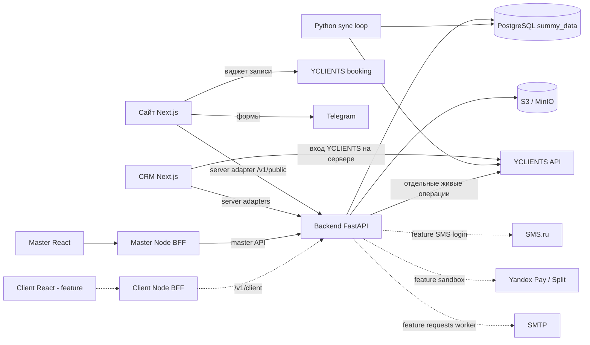
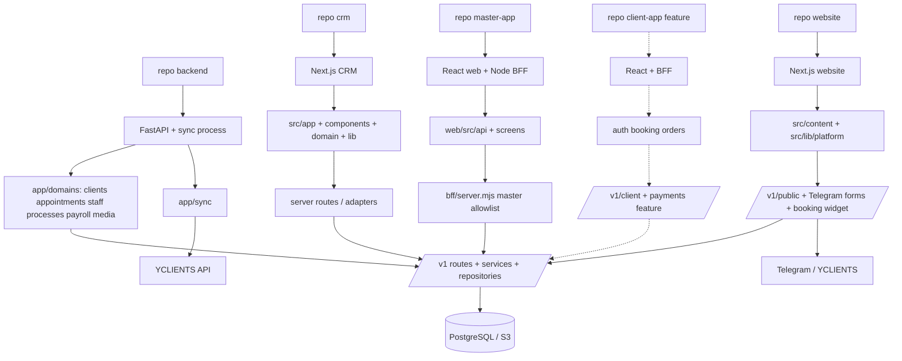

# Архитектура реализации

[Вход в DOC](../AGENTS.md) · Срез исходников **19.09.2026** · [SHA](repositories.md)

## Компоненты и стек

| Компонент | Стек и устройство | Источник |
|---|---|---|
| Backend | Python ≥3.14, FastAPI, Pydantic 2, SQLAlchemy 2, asyncpg/psycopg, Alembic, httpx, MinIO SDK | [backend/pyproject.toml](https://github.com/kirillsummy/backend/blob/bbfe5e5e22ca2eedbaf58db2899a60c4cdfa70f3/pyproject.toml) |
| CRM | Next.js 16, React 19, TypeScript, Tailwind 4, Radix; серверные routes и адаптеры | [crm/package.json](https://github.com/kirillsummy/crm/blob/0e3f6763e00323703526f043b7fd4166b324ea55/package.json) |
| Master | React 19, Vite 8, TypeScript, React Router 7, Tailwind 4; отдельный Node HTTP BFF | [master-app/web/package.json](https://github.com/kirillsummy/master-app/blob/84f3d0a74584c549ed50070f0f3fbc2eee0f5515/web/package.json), [master-app/bff/server.mjs](https://github.com/kirillsummy/master-app/blob/84f3d0a74584c549ed50070f0f3fbc2eee0f5515/bff/server.mjs) |
| Website | Next.js 16, React 19, TypeScript, Tailwind 4, Radix/Motion; контент в репозитории | [website/package.json](https://github.com/kirillsummy/website/blob/164dc5253a67ae1f1ab956eaaeeb6e439e633e76/package.json), [website/README.md](https://github.com/kirillsummy/website/blob/164dc5253a67ae1f1ab956eaaeeb6e439e633e76/README.md) |
| Client, только feature | React 19, Vite 8, TypeScript, React Router 7, Node BFF | [client-app/package.json](https://github.com/kirillsummy/client-app/blob/4e38ed8f527f27348a4661b4d0e1c7e8a98ab42d/package.json) |
| Хранение | PostgreSQL; метаданные медиа в БД, файлы в S3-совместимом хранилище | [backend/app/domains/media/models.py](https://github.com/kirillsummy/backend/blob/bbfe5e5e22ca2eedbaf58db2899a60c4cdfa70f3/app/domains/media/models.py), [backend/docs/DEPLOY.md](https://github.com/kirillsummy/backend/blob/bbfe5e5e22ca2eedbaf58db2899a60c4cdfa70f3/docs/DEPLOY.md) |

Node 24 используется продуктовым tooling/CI; фактические версии серверных
процессов этим обзором не измерялись. Celery/Redis и прежний Django-кабинет
не входят в описанную основную ветку master-app/backend. Исторические ветки
сохраняются в [реестре](branches.md); наличие старой инструкции не доказывает живой сервис.

## Карта зависимостей

Сплошные стрелки — связи в основных ветках; пунктир — отдельные feature-ветки.
Диаграмма описывает исходники, а не замер сети production.

Источники: [backend/app/main.py](https://github.com/kirillsummy/backend/blob/bbfe5e5e22ca2eedbaf58db2899a60c4cdfa70f3/app/main.py), [backend/app/sync/loop.py](https://github.com/kirillsummy/backend/blob/bbfe5e5e22ca2eedbaf58db2899a60c4cdfa70f3/app/sync/loop.py),
[backend/docker-compose.prod.yml](https://github.com/kirillsummy/backend/blob/bbfe5e5e22ca2eedbaf58db2899a60c4cdfa70f3/docker-compose.prod.yml), [crm/src/lib/auth/yclients-auth.ts](https://github.com/kirillsummy/crm/blob/0e3f6763e00323703526f043b7fd4166b324ea55/src/lib/auth/yclients-auth.ts),
[master-app/bff/README.md](https://github.com/kirillsummy/master-app/blob/84f3d0a74584c549ed50070f0f3fbc2eee0f5515/bff/README.md), [website/src/lib/platform.ts](https://github.com/kirillsummy/website/blob/164dc5253a67ae1f1ab956eaaeeb6e439e633e76/src/lib/platform.ts),
[website/src/lib/site.ts](https://github.com/kirillsummy/website/blob/164dc5253a67ae1f1ab956eaaeeb6e439e633e76/src/lib/site.ts), [ветки новых потоков](current-state.md).

## Repository → Application → Module → API/Service → Dependency

`governance`, `docs`, `context`, `workspace` не обслуживают продуктовый HTTP API:
это документация, память и инструменты. Подробная карта папок: [repositories](repositories.md).

## Backend: владение модулями

| Область | Домены `app/domains/` | Потребители / зависимости |
|---|---|---|
| Люди и сеть | `organizations`, `locations`, `staff`, `staff_registry`, `clients`, `resources` | CRM, мастер; свои UUID и внешние ссылки |
| Записи и рабочий день | `appointments`, `visits`, `schedule`, `master_cabinet`, `admin_shift_reports`, `cleaning` | CRM и мастер; зеркальные данные и отдельные вызовы YCLIENTS |
| Деньги и услуги | `earnings`, `payroll`, `pricing`, `calculator`, `bonus_tasks`, `services`, `catalog`, `tech_cards` | Серверные расчёты, SQL VIEW; фронты показывают DTO |
| Материалы и склад | `materials`, `warehouses` | CRM; движения и справочники |
| Процессы и найм | `processes`, `recruitment`, `vacancies` | CRM, мастер, сайт; заявки/уведомления пока имеют разрывы |
| Публикация и медиа | `media`, `public_api`, `reviews` | CRM, мастер, сайт; S3 и публикационные правила |
| Служебные | `auth`, `analytics`, `freshness`, `sync_jobs`, `mirror_check` | Вход, диагностика свежести зеркала и синхронизации |

Это инвентаризация директорий и регистрации роутеров, не обещание отдельного
публичного API для каждой папки. Общий путь: **router → service → repository → БД**;
DTO находятся в `schemas.py`, ORM — в `models.py`, но не каждый домен имеет все слои.
Источники: [backend/README.md](https://github.com/kirillsummy/backend/blob/bbfe5e5e22ca2eedbaf58db2899a60c4cdfa70f3/README.md), [backend/app/main.py](https://github.com/kirillsummy/backend/blob/bbfe5e5e22ca2eedbaf58db2899a60c4cdfa70f3/app/main.py),
[дерево backend](https://github.com/kirillsummy/backend/tree/bbfe5e5e22ca2eedbaf58db2899a60c4cdfa70f3/app/domains).

## Источники данных и важные границы

- YCLIENTS остаётся внешним источником части учётных/операционных данных;
  sync сохраняет внешние связи/raw и обновляет собственное представление.
  PostgreSQL обслуживает внутренние чтения; это не означает, что все записи
  уже перенесены с внешнего API.
- Продуктовые сущности, процессы, склад и денежные правила принадлежат backend.
  Слои raw/core/contract — логические; физическая схема описана в [database](database.md).
- Сайт хранит собственный редакционный контент и использует ограниченные
  публичные DTO платформы; сайт не является владельцем БД персонала.
- BFF хранит сервисные секреты на сервере и ограничивает маршруты; его наличие
  не закрывает все риски пользовательских прав. [API](api.md).

Источники: [ADR-0001](../decisions/0001-data-platform.md),
[ADR-0002](../decisions/0002-single-backend.md), [backend/app/domains/staff/models.py](https://github.com/kirillsummy/backend/blob/bbfe5e5e22ca2eedbaf58db2899a60c4cdfa70f3/app/domains/staff/models.py),
[website/src/lib/platform.ts](https://github.com/kirillsummy/website/blob/164dc5253a67ae1f1ab956eaaeeb6e439e633e76/src/lib/platform.ts), [master-app/bff/README.md](https://github.com/kirillsummy/master-app/blob/84f3d0a74584c549ed50070f0f3fbc2eee0f5515/bff/README.md).

Реестр файлов и границы исследования: [sources.md](sources.md).
