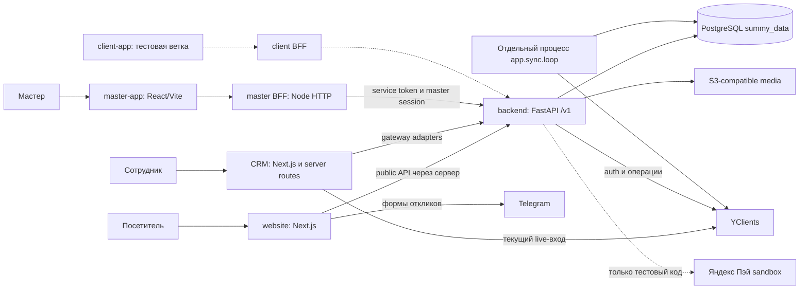

# Архитектура

Срез кода базовых веток на **19.09.2026**; SHA — [repositories](repositories.md). Правило единого backend закреплено [ADR-0002](../decisions/0002-single-backend.md). Оно не означает, что все legacy-интеграции уже удалены.

## Сервисы и потоки

Сплошные рёбра подтверждены кодом основных веток, пунктир — тестовая реализация. Диаграмма не подтверждает текущую доступность внешних систем. Источники: [backend/app/main.py](https://github.com/kirillsummy/backend/blob/bbfe5e5e22ca2eedbaf58db2899a60c4cdfa70f3/app/main.py), [backend/docker-compose.prod.yml](https://github.com/kirillsummy/backend/blob/bbfe5e5e22ca2eedbaf58db2899a60c4cdfa70f3/docker-compose.prod.yml), [backend/app/sync/loop.py](https://github.com/kirillsummy/backend/blob/bbfe5e5e22ca2eedbaf58db2899a60c4cdfa70f3/app/sync/loop.py), [crm/src/lib/auth/yclients-auth.ts](https://github.com/kirillsummy/crm/blob/0e3f6763e00323703526f043b7fd4166b324ea55/src/lib/auth/yclients-auth.ts), [master-app/bff/README.md](https://github.com/kirillsummy/master-app/blob/84f3d0a74584c549ed50070f0f3fbc2eee0f5515/bff/README.md), [website/src/lib/platform.ts](https://github.com/kirillsummy/website/blob/164dc5253a67ae1f1ab956eaaeeb6e439e633e76/src/lib/platform.ts).

## Стек

| Часть | Зафиксировано в manifest/конфигурации |
|---|---|
| CRM | Next.js 16.2.10, React 19.2.4, TypeScript, Tailwind 4, Radix/shadcn, TanStack Table, Recharts, Vitest; Node 24 |
| Сайт | Next.js ^16.2.10, React 19.2.4, TypeScript, Tailwind 4, Radix, Motion; Node 24 |
| Мастер | React 19.2.4, Vite 8.1.5, React Router 7, TypeScript, Tailwind 4; BFF на встроенном HTTP Node |
| Backend | Python >=3.14, FastAPI, Uvicorn, Pydantic 2, SQLAlchemy 2, asyncpg/psycopg, Alembic, HTTPX, MinIO SDK, Pillow; uv.lock |
| Клиент, feature-ветка | React + TypeScript + React Router + Vite; отдельный Node BFF, демонстрационный режим отделён от backend |
| Данные | PostgreSQL; S3-compatible объектное хранилище; MinIO в локальных/стендовых compose |

Версии выше — декларации manifest, не полный SBOM и не версии реально работающих процессов: [crm/package.json](https://github.com/kirillsummy/crm/blob/0e3f6763e00323703526f043b7fd4166b324ea55/package.json), [website/package.json](https://github.com/kirillsummy/website/blob/164dc5253a67ae1f1ab956eaaeeb6e439e633e76/package.json), [master-app/web/package.json](https://github.com/kirillsummy/master-app/blob/84f3d0a74584c549ed50070f0f3fbc2eee0f5515/web/package.json), [backend/pyproject.toml](https://github.com/kirillsummy/backend/blob/bbfe5e5e22ca2eedbaf58db2899a60c4cdfa70f3/pyproject.toml), [client-app/README.md](https://github.com/kirillsummy/client-app/blob/319330ae8082426b8b7f00dded184d1cf22497e4/README.md).

## Границы и источники данных

- Backend — API и доменные правила. Публичные приложения не подключаются к БД напрямую. Серверы фронтендов передают сервисный токен, браузеру его не выдают.
- YClients остаётся внешним источником части клиентов, записей, расписаний, транзакций и отзывов. Синк сохраняет raw-данные, внешние связи и журнал; SUMMY добавляет собственные сущности и бизнес-правила. Реестр и расписание синка — в backend, не во фронтах.
- PostgreSQL хранит собственные данные и зеркало; contract-витрины предоставляют согласованные представления для доменов. Миграции, а не ORM, определяют всю схему. Подробнее [database](database.md).
- Медиа хранится объектами; метаданные, связи и правила доступа — backend/БД. На сайте остаётся собственный контентный слой. «Все данные сайта уже в backend» — неверное утверждение.
- Денежные расчёты — pricing/payroll/earnings, а не клиентские вычисления. Наличие сущности payout не означает подключённый банковский перевод.
- CRM live-вход основной ветки обращается к YClients; перенос авторизации и усиление BFF существуют в отдельных feature-ветках. Не описывать их как включённые по умолчанию.

## Структура исполнения

FastAPI создаётся в `app/main.py`: настройки, lifespan, БД и интеграции, обработчики ошибок, request-id, health/ready, регистрация доменных роутеров. В домене обычная цепочка `router → service → repository`, формы — `schemas.py`. Некоторые домены используют SQL-витрины, ORM покрывает не всё. Синк запускается отдельным сервисом compose командой `python -m app.sync.loop`; оснований называть его Celery нет.

CRM использует App Router и серверные адаптеры `src/lib/adapters/*-gateway.ts`. Мастер — SPA `web/src/App.tsx` с BFF `bff/server.mjs`, который также раздаёт собранный web/dist. Сайт — Next.js, серверный модуль `src/lib/platform.ts` и локальный контент. Клиентская feature-ветка — `src/App.tsx` + `server/index.mjs` с префиксом /client/.

Источники деталей и карта Repository → Application → Module → API → dependency: [modules](modules.md). Авторизация и ошибки: [api](api.md). Развёртывание/окружения: [infrastructure](infrastructure.md). Просмотренные файлы: [sources](sources.md).
