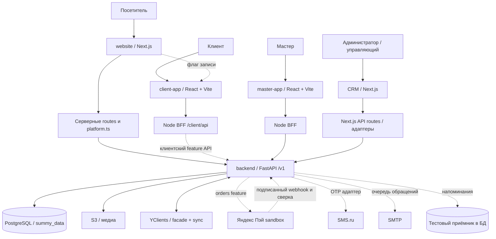

# Текущая архитектура

Это карта проверенного кода, а не схема развёрнутого production.
Сплошные линии — существующие компоненты/интеграционные пути; пунктир — код feature
или внешнее подключение, не принятое сквозным прогоном. SHA и статус веток —
[repositories](repositories.md), [branches](branches.md).

Схема не означает, что все показанные функции включены одновременно. Яндекс Пэй,
SMS и SMTP имеют код, но подключение в проверяемом окружении не подтверждено.
Кассового адаптера и узла «сохранённые карты» в реализации этого среза нет.

## Стек и границы

| Слой | Обнаруженная реализация |
|---|---|
| website | Next.js 16, React 19, TypeScript, Tailwind 4; App Router, локальный editorial-контент и серверные чтения backend |
| CRM | Next.js 16, React 19, TypeScript, Tailwind 4, Radix/shadcn; API routes выступают BFF |
| master-app | React 19, React Router 7, Vite 8, TypeScript; `web/` и Node `bff/server.mjs` |
| client-app feature | React 19, React Router 7, Vite 8, TypeScript; `src/`, Node `server/index.mjs`, префикс `/client` |
| Backend | Python >=3.14 по manifest, FastAPI/Pydantic 2, SQLAlchemy 2 async, asyncpg/psycopg, httpx, Alembic |
| Хранение | PostgreSQL 18 в compose backend, одна схема `summy_data`; S3, локально MinIO |
| Проверки | Vitest/Testing Library и Node tests; pytest, Ruff, mypy, vulture, deptry; продуктовые проверки палитры/канона |

Версии здесь — прочитанные manifests, не обещание текущих установленных зависимостей
и не перечень точных версий production. Node manifests четырёх фронтов требуют 24.x.

## Источники данных

Backend — единственный владелец схемы и денежных правил по ADR-0002.
`raw_objects` сохраняет внешнее сырьё; нормализованные сущности и `contract_v1_*`
дают приложениям общую модель. YClients остаётся внешним источником расписания,
записей и части справочников. Фасад объединяет auth, booking, companies, staff,
catalog, resources, records, clients, comments, transactions, loyalty, schedule.
Наличие компонента фасада не доказывает рабочее подключение каждого внешнего метода.

Свободное время нового заказа получается через общий backend/YClients и дополняется
локальными резервами. `sales_orders` не означает, что все прежние таблицы записи
удалены: `appointments` и `client_portal_orders` продолжают участвовать в потоке.
Начисления и выплаты — существующие `payroll`/`earnings`, не копия в orders.

Сайт не полностью «тонкий»: серверный `platform.ts` получает портфолио и другие
данные, но `src/lib/site.ts` ещё содержит собственные контакты/ссылки/студии.
Полная централизация всего контента не подтверждена.

## Авторизация и межсервисные границы

- Вызовы BFF → backend используют `X-API-Token`. Это статический сервисный токен,
  не доказанная система индивидуальных API scopes для каждого потребителя.
- CRM и мастер имеют серверные сессии; новый orders дополнительно проверяет
  `X-Session-Token` / `X-Master-Session-Token` и роль/владение на backend.
- Клиентский OTP хранится хешем, сессия связана с account и CRM client;
  BFF хранит токен в HttpOnly cookie и проксирует по allowlist.
- Не переносить права нового orders на все legacy endpoints по аналогии:
  часть старых административных API опирается на сервисную границу/BFF.
- Ветки SUMMY ID обнаружены отдельно. Они не являются доказательством уже
  включённого единого SSO или отказа от YClients-входа.

## Решения и исторический слой

ADR-0001 сохраняет историю появления своей БД и raw/core/contract.
Его описания Django, прямого SQL из приложений и отдельной БД кабинета —
исторический контекст, а не инструкция разворачивать это сегодня.
Текущий ориентир — ADR-0002 и код React/BFF/FastAPI.

Подробная цепочка Repository → Application → Module → API → Dependency находится
в [repositories](repositories.md); связи сущностей — в [database](database.md).

## Просмотренные источники

- [governance/decisions/0001-data-platform.md](https://github.com/kirillsummy/governance/blob/3f013b1071d38e1f534c297011d76e467f73ee14/decisions/0001-data-platform.md) — история
- [governance/decisions/0002-single-backend.md](https://github.com/kirillsummy/governance/blob/3f013b1071d38e1f534c297011d76e467f73ee14/decisions/0002-single-backend.md) — единый backend
- [backend/README.md](https://github.com/kirillsummy/backend/blob/ea174dd267c873cc7ae1b8a95fb63d6c456fdf8a/README.md) — стек и слои
- [backend/pyproject.toml](https://github.com/kirillsummy/backend/blob/ea174dd267c873cc7ae1b8a95fb63d6c456fdf8a/pyproject.toml) — зависимости
- [backend/app/main.py](https://github.com/kirillsummy/backend/blob/ea174dd267c873cc7ae1b8a95fb63d6c456fdf8a/app/main.py) — регистрация доменов
- [backend/app/integrations/yclients/facade.py](https://github.com/kirillsummy/backend/blob/ea174dd267c873cc7ae1b8a95fb63d6c456fdf8a/app/integrations/yclients/facade.py) — внешний фасад
- [backend/app/security.py](https://github.com/kirillsummy/backend/blob/ea174dd267c873cc7ae1b8a95fb63d6c456fdf8a/app/security.py) — сервисный токен
- [master-app/bff/README.md](https://github.com/kirillsummy/master-app/blob/01ce8b333ecd69abf0b747941d95c57d54b55cc5/bff/README.md) — транспорт мастера
- [client-app/server/index.mjs](https://github.com/kirillsummy/client-app/blob/319330ae8082426b8b7f00dded184d1cf22497e4/server/index.mjs) — клиентский BFF
- [crm/src/lib/auth/gateway-login.ts](https://github.com/kirillsummy/crm/blob/d848696711516b83fb062b71a334ed5e84199b5b/src/lib/auth/gateway-login.ts) — сессии CRM
- [website/src/lib/platform.ts](https://github.com/kirillsummy/website/blob/109648cdade7511ab656a60a0e277372cd7a72d6/src/lib/platform.ts) — серверная интеграция

Границы чтения и полный реестр: [sources.md](sources.md).
