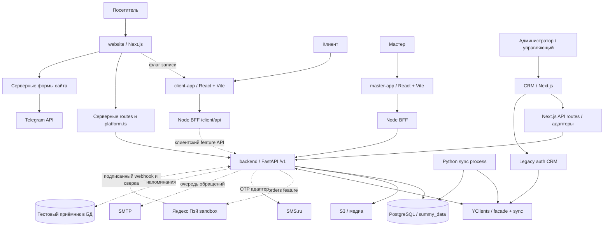

# Архитектура SUMMY

Описание кода по закреплённым срезам 19.09.2026. [Состояние и незавершённое](../current-state.md)
отделяет основные ветки, feature-код и наблюдения среды.

| Раздел | Содержание |
|---|---|
| [Сайт](website.md) | Next.js, публичные страницы, контент, формы, запись |
| [Backend](backend.md) | FastAPI, домены, БД, sync, права и расчёты |
| [CRM](crm.md) | Управление, Next BFF, gateway-адаптеры и роли |
| [Приложение мастера](master-app.md) | React, BFF, смены, визиты, профиль и финансы |
| [Клиентское приложение](client-app.md) | Телефон, бронирование, заказы, история, оплата |

## Общая схема

Сплошные связи обозначают существующий путь кода, пунктир — feature/непринятое
внешнее подключение. Это не измеренная сеть production. Вход CRM ещё имеет
legacy-путь к YClients; нельзя считать все способы входа уже объединёнными в backend.

## Владение

Данные и расчёты принадлежат backend. BFF хранит сессию/секреты на сервере и
ограничивает HTTP-поверхность. Сайт сохраняет часть редакционного контента у себя.
YClients остаётся внешним источником/исполнителем части операций; полного отказа нет.
Синхронизация запускается отдельным Python-процессом, не во frontend.

Общие детали: [БД](../database.md), [API и авторизация](../api.md),
[инфраструктура](../infrastructure.md), [цепочки модулей](../modules.md).
Репозитории governance/docs/context/workspace не являются продуктовыми API.

Источники и SHA: [реестр](../sources.md), [репозитории](../repositories.md).
Исторический Django/прямой SQL из фронтов не переносить из ADR-0001 в актуальную схему:
его уточняет [ADR-0002](../../decisions/0002-single-backend.md).
