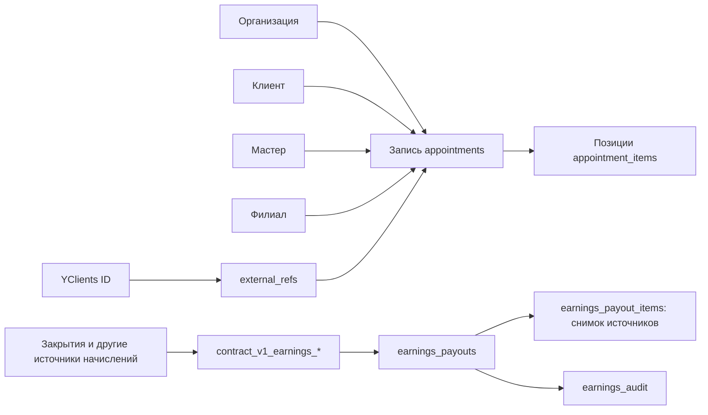

# Данные и БД

Срез исходников backend **19.09.2026**. Боевой каталог БД и применённые ревизии в этом аудите не запрашивались. Число таблиц или строк из старой заметки нельзя выдавать за текущий замер.

## Владелец и схема

Владелец записи и миграций — backend. PostgreSQL использует схему `summy_data` и search_path `summy_data,public`. Alembic и ручные SQL-ревизии — источник схемы; SQLAlchemy-модели служат запросам, не заменяют миграции. `OrgScopedMixin` содержит UUID, organization_id и deleted_at; строки позиций могут наследовать область доступа через родителя. Источники: [backend/app/orm.py](https://github.com/kirillsummy/backend/blob/bbfe5e5e22ca2eedbaf58db2899a60c4cdfa70f3/app/orm.py), [backend/app/domains/appointments/models.py](https://github.com/kirillsummy/backend/blob/bbfe5e5e22ca2eedbaf58db2899a60c4cdfa70f3/app/domains/appointments/models.py), [backend/AGENTS.md](https://github.com/kirillsummy/backend/blob/bbfe5e5e22ca2eedbaf58db2899a60c4cdfa70f3/AGENTS.md).

Слои raw/core/contract — логическое разделение: сырые внешние объекты и journal → нормализованные сущности/идентификаторы → SQL-представления для потребителей. Это не три подтверждённые независимые БД. [ADR-0001](../decisions/0001-data-platform.md), [backend/app/sync/loop.py](https://github.com/kirillsummy/backend/blob/bbfe5e5e22ca2eedbaf58db2899a60c4cdfa70f3/app/sync/loop.py).

## Основные сущности и связи

| Группа | Связи и роль |
|---|---|
| Организация, филиал, сотрудник, клиент | Организационная область доступа; запись содержит location_id, client_id и staff_id |
| appointments / appointment_items | Запись → позиции услуг, мастер, начало/конец, сумма/валюта, status/source_channel; у позиции снимки услуги/мастера |
| visits / visit_items | Отдельная модель посещений и API; наличие таблицы не доказывает наполнение и использование экраном истории |
| raw_objects / external_refs / sync_runs | Сырьё, сопоставление внешних ID с платформой, журнал синхронизации |
| staff / staff_user, профиль и медиа | Сотрудник, внешняя учётка и человек связаны явными идентификаторами; фото/портфолио/документы имеют собственные правила доступа |
| Процессы, типы, стадии, поля, вложения | Общий механизм операционных карточек, включая рекламации и сменные процессы |
| pricing / payroll / earnings | Прайс и начисления → витрины заработка → резервирование и снимок состава выплаты → аудит |
| Материалы / склады / остатки / движения | Справочники и учёт склада, отдельные домены backend |

Это карта областей, не полный ERD. Точное ограничение FK нужно смотреть в соответствующей миграции: одинаковый суффикс `_id` сам по себе его не доказывает. Источники: [backend/app/domains/appointments/models.py](https://github.com/kirillsummy/backend/blob/bbfe5e5e22ca2eedbaf58db2899a60c4cdfa70f3/app/domains/appointments/models.py), [backend/app/domains/visits/repository.py](https://github.com/kirillsummy/backend/blob/bbfe5e5e22ca2eedbaf58db2899a60c4cdfa70f3/app/domains/visits/repository.py), [backend/docs/earnings-payouts.md](https://github.com/kirillsummy/backend/blob/bbfe5e5e22ca2eedbaf58db2899a60c4cdfa70f3/docs/earnings-payouts.md), [master-identity](../contracts/master-identity.md); полный список модулей — [modules](modules.md).

Диаграмма показывает логические связи; не выдаётся за список физических FK.

## Деньги, время, аудит

В appointments сумма — Decimal/Numeric(14,2), валюта отдельным полем; позиции используют Numeric для количества и цены. Абсолютное время timezone-aware; бизнес-даты не заменять UTC-датой. Конкретное округление зависит от домена, не вводить общий float-расчёт во фронтенде. [backend/app/domains/appointments/models.py](https://github.com/kirillsummy/backend/blob/bbfe5e5e22ca2eedbaf58db2899a60c4cdfa70f3/app/domains/appointments/models.py), [backend/docs/architecture.md](https://github.com/kirillsummy/backend/blob/bbfe5e5e22ca2eedbaf58db2899a60c4cdfa70f3/docs/architecture.md).

`earnings_payout_items` фиксирует состав выплаты, `earnings_adjustments` — отдельные корректировки, `earnings_audit` — след событий. Документ домена описывает уникальное резервирование источника, идемпотентность создания и запрет изменения терминальной выплаты. Старые номера ревизий в этом документе местами исторические: путь текущих SQL искать в Alembic. [backend/docs/earnings-payouts.md](https://github.com/kirillsummy/backend/blob/bbfe5e5e22ca2eedbaf58db2899a60c4cdfa70f3/docs/earnings-payouts.md), [money-dod](../contracts/money-dod.md).

## Тестовое расширение заказов

В отдельной ветке существуют `sales_orders`, платёжные/возвратные операции, локальные резервы календаря и уведомления; клиентский портал и новые миграции 0118–0120. Заказ связан с CRM-клиентом и мастером до оплаты, а provider ID связывается с этим заказом при создании платежа. Начисление использует существующий финансовый контур. Это **не утверждение о применении миграций на проде**. [backend/docs/orders-test.md](https://github.com/kirillsummy/backend/blob/ea174dd267c873cc7ae1b8a95fb63d6c456fdf8a/docs/orders-test.md).

## Как менять схему

Ручная новая Alembic-ревизия, без правки выкаченных ревизий и без autogenerate как источника решения. Проверить граф ревизий, совместимость ORM/SQL/потребителей и миграционные тесты; конфликт номеров при интеграции разрешается новым коммитом. Удаление/изменение данных отдельно согласуется. Не запускать restore/stand-up против ценной БД: старые сценарии восстанавливают дамп с очисткой. Источники: [backend/AGENTS.md](https://github.com/kirillsummy/backend/blob/bbfe5e5e22ca2eedbaf58db2899a60c4cdfa70f3/AGENTS.md), [backend/docs/STAND.md](https://github.com/kirillsummy/backend/blob/bbfe5e5e22ca2eedbaf58db2899a60c4cdfa70f3/docs/STAND.md), [backend/docs/orders-test.md](https://github.com/kirillsummy/backend/blob/ea174dd267c873cc7ae1b8a95fb63d6c456fdf8a/docs/orders-test.md).

## Исторические ловушки

- `data/README.md` локального старого workspace описывает самостоятельные checksum-миграции PostgreSQL 16. Это исторический исходник платформы, не второй текущий журнал. [MAP](../MAP.md) сохраняет результаты сравнения от 16.08.
- «visits пустая» и конкретные количества appointments/витрин — замер **18.08**, не текущее состояние. В коде по-прежнему есть visits API, а клиентская история может читать другое представление. Проверять query конкретного потребителя.
- Частный `docs/sistema/baza-dannyh-shema.md` — старый снимок; актуальные ограничения брать из backend. Никакой доступ к prod DB для DOC не выполнялся.

Реестр файлов и снимок дерева миграций: [sources](sources.md).
