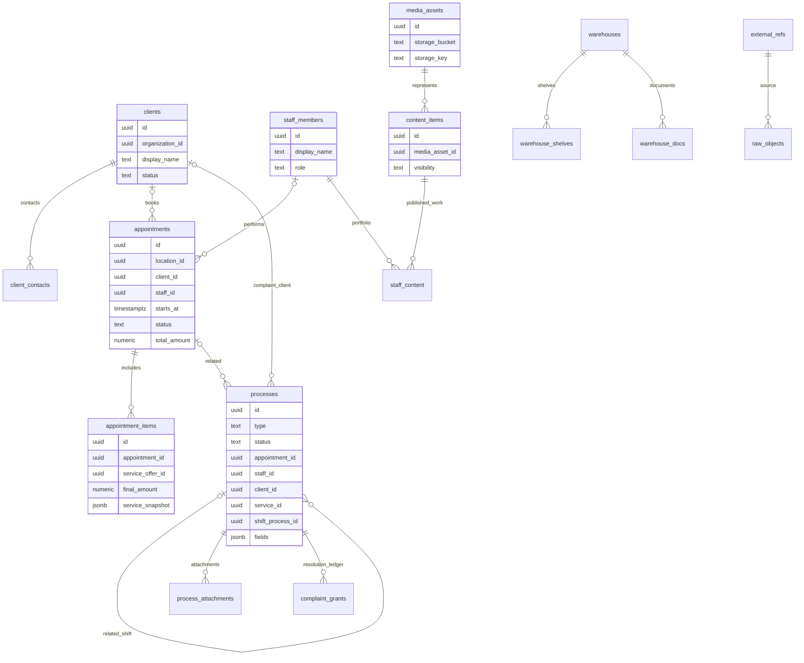
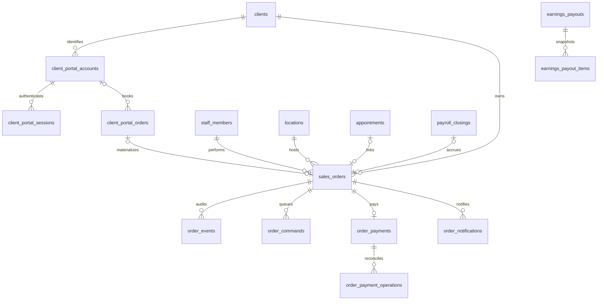

# База данных

[Вход в DOC](../AGENTS.md) · [Источники и SHA](sources.md)

## Текущий ориентир после релиза 25.09.2026

По [журналу фактического состояния](current-state.md) на TEST сначала
применили `0140_admin_shift_process`, затем при отдельной поставке backend —
`0141`. Это отчёты о выполненных действиях 25.09, **не** повторное чтение
`alembic_version` 26.09. Последняя голова Git `backend/test` и запущенный
сервер могут различаться. Исторические сравнения `work`/`test` ниже оставлены
для аудита расхождений до объединения; не использовать их как текущую матрицу
веток. Действующая матрица — [ветки](branches.md), безопасный способ доступа
и релиза — [инфраструктура](infrastructure.md#подключение-к-test-и-бд).

## Что является источником схемы

В каждой среде своя продуктовая PostgreSQL-БД с физической схемой
`summy_data`; TEST не подключён к production-БД. Логические слои
**raw → core → contract** описывают путь данных, а не три отдельные PostgreSQL-схемы.
Миграциями управляет Alembic backend: raw SQL в ревизиях, начальная ревизия
`0001_baseline`, ORM не используется для генерации всей схемы.
Источники: [ADR-0001](../decisions/0001-data-platform.md),
[backend/alembic/env.py](https://github.com/kirillsummy/backend/blob/bbfe5e5e22ca2eedbaf58db2899a60c4cdfa70f3/alembic/env.py), [backend/alembic/versions/0001_baseline.py](https://github.com/kirillsummy/backend/blob/bbfe5e5e22ca2eedbaf58db2899a60c4cdfa70f3/alembic/versions/0001_baseline.py).

База снимка `backend/dev` заканчивается файлами `0116_otzyvy_zerkalo`.
Это состояние Git, а не значение `alembic_version` на сервере.
Историческая схема в репозитории `docs` и архивные SQL в `data/` не образуют
второй журнал миграций. Источник: [дерево ревизий](https://github.com/kirillsummy/backend/tree/bbfe5e5e22ca2eedbaf58db2899a60c4cdfa70f3/alembic/versions),
[историческая проверка](https://github.com/kirillsummy/governance/blob/263d84b60a4f03bf158453f1fe7d295db146e1ab/docs/history/map-before-consolidation.md).

В срезе `backend/work` `ca369db` на 25.09.2026 цепочка
продолжена до `0139_complaint_shift_organization_guard`:
`0125` — каноническая модель, `0127` — идемпотентность создания,
`0128` — задания, `0130` — сверка начислений, `0131` — переделка,
`0132` — снимок ставки штрафного балла, `0133` — виды событий решения,
`0134` — правило фотоподтверждений v2, `0135` — запросы наличного вывода;
`0136`–`0139` описаны ниже.
В том срезе `backend/test` содержал **тот же файл `0125`** и заканчивался
`0126`, а базовая ветка `dev` — `0116`; `test` и `work` разошлись по Git.
Наличие файлов в Git не доказывало применение в БД; `alembic_version`
test/production тогда не проверялся. Порядок приёмки и обязательные действия
владельца БД закреплены в
[контракте рекламаций](../contracts/reklamaciya.md).

## Основные сущности и поля

Это обзор прочитанных моделей, **не полный DDL**. Типы/nullable/индексы/каскады
проверяют по последней миграции, затем по реальной схеме целевой среды.
Общие поля OrgScoped-моделей и связи не следует переносить на все таблицы:
например, `processes` и строки записей устроены иначе.

| Таблица | Ключевые поля из моделей | Связь / назначение |
|---|---|---|
| `staff_members` | `id`, `organization_id`, `display_name`, `first_name`, `last_name`, `role`, `specialization`, `description`, `origin`, `version` | Внутренняя личность сотрудника |
| `external_refs` | `id`, `connection_id`, `entity_type`, `internal_id`, `external_id`, `deleted_at` | Полиморфное соответствие внешнему объекту; `internal_id` не означает FK к одной таблице |
| `raw_objects` | `id`, `external_ref_id`, `object_type`, `payload`, `payload_hash`, `received_at`, `is_deleted` | Полученный внешний объект и его история/состояние |
| `clients` | `id`, `organization_id`, `display_name`, `first_name`, `last_name`, `birth_date`, `gender`, `status`, `version` | Клиент сети |
| `client_contacts` | `id`, `client_id`, `contact_type`, `value_raw`, `value_normalized`, `is_primary`, `is_verified` | Контакты отдельно от карточки клиента |
| `client_referrals` | `id`, `inviter_client_id`, `invited_client_id` | Кто пригласил клиента; уникальность активной связи задаёт миграция |
| `client_notes` | `id`, `client_id`, `author_ref`, `body`, `visibility`, `source`, `deleted_at` | История заметок; автор может быть внешним/неизвестным |
| `appointments` | `id`, `organization_id`, `location_id`, `client_id`, `staff_id`, `starts_at`, `ends_at`, `status`, `total_amount`, `currency`, `source_channel`, `complaint_process_id`, `source_appointment_id`, `is_free_redo` | Запись клиента; nullable-связи переделки добавлены в work ревизией 0131 |
| `appointment_items` | `id`, `appointment_id`, `service_offer_id`, `staff_id`, `quantity`, `unit_price`, `discount_amount`, `final_amount`, `service_snapshot`, `staff_snapshot` | Позиции записи и снимки услуги/мастера |
| `processes` | `id`, `type`, `title`, `status`, `priority`, `assignee_role`, `appointment_id`, `staff_id`, `client_id`, `service_id`, `shift_process_id`, `location_id`, `create_request_id`, `create_request_hash`, `fields`, `source`, `external_ref` | Связи рекламации вынесены из анкеты в FK; `location_id` для системной смены администратора добавляет ревизия 0140 только в work |
| `process_types` | `id`, `code`, `label`, `scope`, `statuses`, `transitions`, `fields`, `initial_status` | Описания видов/переходов — данные |
| `process_attachments` | `id`, `process_id`, `storage_key`, `content_type`, `size_bytes`, `deleted_at` | Метаданные вложения; байты в объектном хранилище |
| `process_tasks` | `id`, `organization_id`, `process_id`, `kind`, `title`, `required`, `status`, `assignee_role`, `assignee_id`, `due_at`, `completed_at` | Универсальные задания и сроки процесса; 0128 |
| `complaint_grants` | `id`, `complaint_id`, `decision_kind`, `bonus_size`, `amount_rub`, `status`, `idempotency_key`, `fail_reason`, `grant_note`, `granted_at` | Журнал попыток предоставления; завершённые строки защищены от UPDATE/DELETE |
| `complaint_grant_reconciliations` | `id`, `organization_id`, `complaint_id`, `grant_id`, `outcome`, `note`, `idempotency_key`, `created_by_id`, `created_at` | Отдельный append-only результат операторской сверки; 0130 |
| `warehouses` / `warehouse_shelves` | `id`, `name`, `deleted_at`; у полки `warehouse_id` | Склад и адресное хранение; склад не обязательно студия |
| `warehouse_docs` | `id`, `warehouse_id`, `target_warehouse_id`, `doc_type`, `reason`, `actor_id` | Проведённые документы движений; остаток вычисляется по строкам |
| `media_assets` | `id`, `storage_bucket`, `storage_key`, `mime_type`, `size_bytes`, `checksum_sha256`, `processing_status`, `metadata` | Файл в S3 и его метаданные |
| `content_items` | `id`, `media_asset_id`, `purpose`, `visibility`, `moderation_status`, `published_at` | Публикационное представление медиа |
| `staff_content` | `staff_id`, `content_item_id`, `sort_order` | Портфолио сотрудника; раздел витрины — дополнительное свойство связи |
| `gateway_admin_access` | `id`, `yclients_user_id`, `role`, `display_name`, `is_active`, `deleted_at` | Допуск в CRM |
| `gateway_role_sections` | `id`, `role`, `section_key`, `is_visible`, `can_edit` | Права разделов; таблица сама по себе не доказывает проверку каждого HTTP-метода |

Источники моделей:
[backend/app/domains/staff/models.py](https://github.com/kirillsummy/backend/blob/bbfe5e5e22ca2eedbaf58db2899a60c4cdfa70f3/app/domains/staff/models.py), [backend/app/domains/clients/models.py](https://github.com/kirillsummy/backend/blob/bbfe5e5e22ca2eedbaf58db2899a60c4cdfa70f3/app/domains/clients/models.py),
[backend/app/domains/appointments/models.py](https://github.com/kirillsummy/backend/blob/bbfe5e5e22ca2eedbaf58db2899a60c4cdfa70f3/app/domains/appointments/models.py), [backend/app/domains/processes/models.py](https://github.com/kirillsummy/backend/blob/bbfe5e5e22ca2eedbaf58db2899a60c4cdfa70f3/app/domains/processes/models.py),
[backend/app/domains/warehouses/models.py](https://github.com/kirillsummy/backend/blob/bbfe5e5e22ca2eedbaf58db2899a60c4cdfa70f3/app/domains/warehouses/models.py), [backend/app/domains/media/models.py](https://github.com/kirillsummy/backend/blob/bbfe5e5e22ca2eedbaf58db2899a60c4cdfa70f3/app/domains/media/models.py),
[backend/app/domains/auth/models.py](https://github.com/kirillsummy/backend/blob/bbfe5e5e22ca2eedbaf58db2899a60c4cdfa70f3/app/domains/auth/models.py).

## Обзор связей

Диаграмма показывает основные предметные связи по моделям; не заявляет,
что каждая линия обеспечивается FK в работающей БД. Nullable-ссылки и
полиморфный `external_refs.internal_id` требуют отдельного внимания.

## Расчётные VIEW и дрейф

Денежные `contract_v1_*` VIEW менялись несколькими миграциями. Нужно брать
последнее определение целиком, чтобы не потерять чужие колонки. ORM описывает
не всю схему; наличие ORM и зелёного unit-теста не подтверждает соответствие DDL.
`backend/db/roles.sql` сейчас содержит лишь закомментированный пример, а не
применённые права: роль `adminapp_ro` должна создаваться оператором БД и
получать явные GRANT на нужные `contract_v1_*`; новая витрина не откроется ей
автоматически. `db/verify.sql` проверяет, в частности, что мастер зеркальной
записи доступен для фильтра визитов и `contract_v1_staff_day_load`.
«Копилка» по ревизии 0054 считает несколько подходящих услуг одной закрытой
записью, со ставкой из настроек. Витрина дневной загрузки учитывает живую
запись и при отсутствии графика, в салонных сутках филиала.
`db/fixtures/payroll-masterapp-fixture.sql` и `payroll-platform-seed.sql` —
вымышленные парные образцы прежнего перелива зарплаты, удалённого 17.08.2026,
а не данные боевой БД. Они фиксируют форму старых таблиц, YClients staff
501/502 и записи 9001–9003; вторая услуга записи 9002 намеренно не имеет
платформенной цены. Плановая запись 9004 не является закрытием и не должна
участвовать в переливе. Эти файлы запускаются лишь в одноразовой БД.
Базовый CI накатывает миграции на чистый PostgreSQL 18 и выполняет `db/verify.sql`.
Автоматическая расширенная сверка схемы/VIEW/OpenAPI добавлена в открытый
[backend PR #80](https://github.com/kirillsummy/backend/pull/80); её нельзя считать
уже встроенной в `dev`. Источники: [backend/docs/DEBT.md](https://github.com/kirillsummy/backend/blob/bbfe5e5e22ca2eedbaf58db2899a60c4cdfa70f3/docs/DEBT.md),
[backend/.github/workflows/ci.yml](https://github.com/kirillsummy/backend/blob/bbfe5e5e22ca2eedbaf58db2899a60c4cdfa70f3/.github/workflows/ci.yml).

В аудите 16.09.2026 для ветки PR #80 получен локальный снимок: 146 таблиц,
44 VIEW, 6 последовательностей, 1917 колонок, 164 FK. **Это исторический
результат миграций на локальной PG18, не инвентаризация production.** Источник:
[schema-contract.json](https://github.com/kirillsummy/backend/blob/f53795b23999402eecfa2faa8f9098e9ce272904/db/schema-contract.json).

## Исторический аудит изменений схемы до объединения веток

Актуальная удалённая рабочая линия backend на 24.09.2026 содержит миграции до `0135`.
Ревизия `0125` добавляет связи рекламации, ограничения согласованности,
индексы фильтрации и защиту append-only журнала `complaint_grants`; последующие
ревизии расширяют создание, задания, сверку, переделку, штрафы и другие домены.
`db/api-contract.json` и `db/schema-contract.json` в work статически содержат
новые поверхности, но их генерация/сравнение в этой проверке не выполнялись.
Перед их
применением владелец БД обязан подтвердить реальный head целевой среды и отсутствие
другой ревизии с тем же номером/`revision`; локальный номер файла не является
доказательством совместимости.

В опубликованном `backend/work` `ca369db` после `0135` добавлены `0136`–`0139`:

- `0136` выводит отсутствующий `processes.organization_id` у старой рекламации
  только при согласии всех найденных связей; неоднозначные записи оставляет
  `NULL`, защищает `process_events` от UPDATE/DELETE, допускает сверку
  сохранённого `chosen` без `fail_reason` и добавляет `flow` в денежный VIEW;
- `0137` хранит явные права филиалов для конкретной активной строки допуска
  CRM; при отсутствии права администратор и управляющий не видят рекламацию;
  `auth_audit` защищён от UPDATE/DELETE;
- `0138` добавляет очередь уведомлений рекламаций в общую `outbox_events`,
  не в `order_notifications`; триггер ставит её из сохранённого события в
  той же транзакции, дедупликация идёт по событию и получателю. Канал доставки
  не утверждён, поэтому `unavailable` не считается отправкой;
- `0139` сначала присваивает старой смене с пустой организацией организацию
  лишь при глобально однозначном коде действующего филиала. Затем проверяет
  существующие связи рекламации со сменой: при неоднозначности или конфликте
  миграция останавливается, не угадывая правильную. Новый DB-триггер требует,
  чтобы `shift_process_id` ссылался на действующую `master_shift` той же
  организации, и запрещает обратное изменение организации/типа/удаления
  связанной смены. Проверка применяется ко всем процессам, использующим это
  поле; конфликты разбирает владелец данных.

Опубликованная в `backend/work` (`51bc8a6`) ревизия
`0140_admin_shift_process` добавляет nullable
`processes.location_id` с FK к филиалу и составной охраной совпадения
организации, CHECK полноты строки `admin_shift`, уникальный индекс одной
открытой смены на администратора и возможность использовать существующие
`create_request_id`/SHA-256 для этого системного вида. `shift_report` и его
табель не меняются. Строка `process_types.admin_shift` создаётся архивной:
прежний backend не покажет её в общей форме между миграцией и кодом, а
DB-ограничение запрещает сделать её обычным выбираемым видом. Открытие и
закрытие оставляют `process_events`. После появления смен downgrade
останавливается, чтобы не удалить факты; старый backend после этого также
не является безопасным откатом. Применение 0140 в реальной БД и новые
generated OpenAPI/schema snapshots не подтверждены.

Локально на новой PostgreSQL 18.6 пройдены миграции с нуля и отдельная
синтетическая репетиция `0126→0139→0135`: однозначная старая рекламация
восстановлена, неоднозначная не угадана, попытка `chosen` без `fail_reason`,
штраф и выплата сохранены. Это **не** копия TEST-БД с реальными данными и не
доказательство, что на TEST уже применена `0125` или более поздняя ревизия.

Откат не равен простому `alembic downgrade`: downgrade ревизий 0127,
0129–0131 и 0133–0135 содержит guards на данные, а
`0132_complaint_penalty_rate_downgrade.sql` удаляет исторический
`point_price_rub`. До изменения БД нужен план совместимости, резервной
копии и восстановления, согласованный владельцем. В compose для API и
миграций используется `POSTGRES_USER` (default `summy_data_owner`);
отдельная runtime-роль мигратора и реальные права test/production не
проверены. Это конфигурация исходника, не проверка ACL.

### Перед применением на TEST — отдельное действие владельца БД

Миграции `0136`–`0139` сейчас являются опубликованным кодом, **не изменением
TEST-БД**. Кирилл либо назначенный им оператор сначала подтверждает подлинность
SSH host key независимо от самого соединения и читает в целевой среде
развёрнутый SHA, `alembic current`/`heads`, `current_user`, владельцев объектов
и право `CREATE` в `summy_data`. Отдельно считает старые рекламации с
`organization_id IS NULL`, неоднозначные связи и существующие связи
`complaint.shift_process_id`, где организация рекламации и смены различается.
При таких строках 0139 намеренно остановится: нельзя исправлять их догадкой,
`stamp`, удалением или ручным переписыванием истории.

До разрешённого `alembic upgrade head` нужны проверенная резервная копия с
точкой восстановления, сохранённый SHA прежнего backend-образа, план
совместимости со старым кодом и окно без параллельного деплоя. После применения
оператор сверяет `alembic current` с головой **именно доставленного коммита**,
новые ограничения/триггеры и безопасные read-only сценарии CRM. `downgrade`
не является универсальным откатом: часть прежних ревизий имеет guards или
теряет историческую ставку, поэтому восстановление проводится по заранее
согласованному плану и копии. Ни этот текст, ни публикация миграций в Git не
разрешают запуск на TEST или production; фактический результат и роль
мигратора записываются сюда без секретов и клиентских данных.

Ниже сохранён исторический контекст ветвления после `0116`; он не описывает
текущий head `backend/work`:

- Тогда в `backend/test` была `0117_staff_invitations` (собственный вход).
- В ветке обращений мастера есть другая `0117_master_requests_hours`.
- Последующие ветки клиентского контура/платежей добавляют
  `0118_client_portal`, `0119_order_payments_test`, `0120_quality_before_payment`.

Это историческое описание независимых линий после `0116`, а не текущий
перечень голов. На момент той сверки `test` дошла до `0126`, `work` — до `0135`, а
`singular` остаётся отдельной линией с головой `0117_staff_invitations`.
Перед объединением проверить
реальные `revision`/`down_revision`, головы Alembic, порядок применения и
совместимость данных; совпадение префикса `0117` уже требует внимания, но
само по себе не доказывает одинаковый внутренний revision ID.
Применённые миграции не переписывают. Источники: [ветки](branches.md),
[backend/test](https://github.com/kirillsummy/backend/tree/test/alembic/versions),
[backend/docs/master-shift-requests.md](https://github.com/kirillsummy/backend/blob/ea174dd267c873cc7ae1b8a95fb63d6c456fdf8a/docs/master-shift-requests.md),
[backend/docs/client-portal.md](https://github.com/kirillsummy/backend/blob/ea174dd267c873cc7ae1b8a95fb63d6c456fdf8a/docs/client-portal.md).

Не запускать restore/миграции по этой странице: действия с окружением выполняются
по runbook участником с фактическим доступом, в порядке очереди релиза. Реестр файлов: [sources](sources.md).

## Существенные инварианты нового контура

- sales_orders: уникальный number; уникальные ссылки на appointment/portal_order,
  хотя бы одна из них обязательна. Время — timestamptz; сумма numeric(14,2), RUB.
- Один order_payment на order, уникальный provider_order_id; environment ограничен sandbox.
  Операции провайдера имеют собственный UUID и уникальность внешней операции в платеже.
- order_events защищён триггером от UPDATE/DELETE. Команда имеет состояния
  queued/dispatching/confirmed/unknown/rejected; активная команда вида уникальна на заказ.
- client_portal_sessions содержит token_hash, не исходный токен. OTP имеет лимит
  попыток, срок жизни, delivered/consumed; аккаунт уникален по организации и телефону.
- 0119 разрешает запись сотрудником без client account; booked_client_id обязателен
  при отсутствии account. Это не создание клиентского согласия от имени сотрудника.
- 0120 делает appointment_closures.payroll_closing_id nullable, чтобы качество
  предшествовало оплате. Откат упадёт, если такие незавершённые связи ещё существуют.
- Состав выплаты earnings резервирует источники единожды; корректировка append-only,
  возврат клиенту не означает автоматическое удержание у мастера.

## Данные feature-заказа

## Миграции и доступ

SQL пишется вручную, Alembic — единственная последовательность; ORM зеркалит схему.
В проверенной feature-цепочке: 0117 → 0118 → 0119 → 0120_quality_before_payment.
В других ветках номера могут пересекаться: это не утверждение о head основной ветки.
Конфликт номеров разрешают новой ревизией/новым коммитом (координирует Юра), применённое не переписывают.

Одна async-сессия/транзакция на запрос; успешный запрос commit, исключение rollback.
Проверки выполняются на отдельной БД, `db/verify.sql` — проверка схемы.
В orders флаг требует точного совпадения ORDERS_TEST_DATABASE и POSTGRES_DB.
Не использовать восстановление дампа как штатное обновление кода: старые stand/up
содержат очистку базы. Этот раздел описывал срез без применения миграций;
позднейшее применение `0140` и `0141` на TEST отражено в начале страницы и
в [текущем состоянии](current-state.md). Production этим не подтверждён.

Обнаруженный долг: `app/db.py` при POSTGRES_SSL включает шифрование, но отключает
проверку сертификата и hostname. Это факт реализации, не рекомендация повторять настройку.
Изменять trust-модель следует с проверкой сертификатов окружения.
