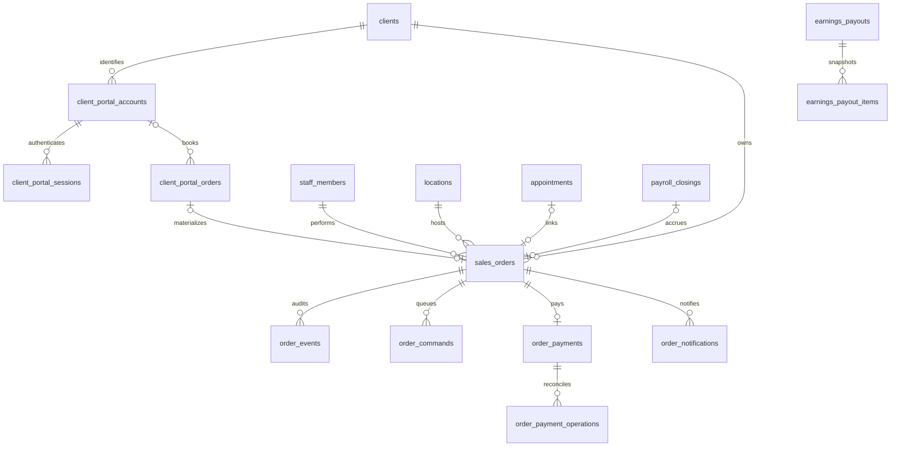

# База данных и основные сущности

Владелец схемы — `backend/alembic/versions`, а не отдельный frontend или старый `data/`.
Слои raw/core/contract — логические; текущая PostgreSQL-схема называется `summy_data`.
Числа строк и таблиц из прежнего MAP относятся к августовским замерам, не к этому снимку.

## Карта сущностей

| Область | Основные сущности / назначение |
|---|---|
| Организация и внешний источник | organizations, source_connections, external_refs, raw_objects; внутренние UUID отделены от ID YClients |
| Справочники | clients, staff_members, locations, services, service_offers |
| Запись | appointments; графики и ресурсы обслуживаются schedule/resources |
| Процессы | processes, process_types, process_events: переходы, сроки, история |
| Деньги | payroll_closings и их услуги; earnings_payouts/items, earnings_adjustments/audit; витрины contract_v1_earnings_* |
| Медиа | Метаданные/связи в БД, бинарные объекты в S3; доступ через backend |
| Смены, feature 0117 | master_shift_work_intervals; master_monthly_work_hours — агрегированное представление с целью 180 часов |
| Клиент, feature 0118 | client_portal_accounts/challenges/sessions, client_portal_orders/events/cancellations |
| Общие заказы, feature 0119 | sales_orders, order_events, order_payments, order_payment_operations, order_commands, order_notifications |

Это навигационная карта, не полный каталог DDL. Имена новых таблиц сверены с SQL;
старые финансовые связи — с контрактом earnings. Не переносить из неё непроверенные
NOT NULL/каскады/типы: точный DDL берётся из указанного SHA миграций.

Диаграмма показывает выбранные FK/кардинальности нового контура. Начисление → состав
выплаты связано через существующие источники earnings; прямой FK order → payout здесь
не заявлен. `sales_orders.items` — JSONB-состав; это не отдельная таблица order_items.

## Существенные инварианты нового контура

- sales_orders: уникальный number; уникальные ссылки на appointment/portal_order,
  хотя бы одна из них обязательна. Время — timestamptz; сумма numeric(14,2), RUB.
- Один order_payment на order, уникальный provider_order_id; environment ограничен sandbox.
  Операции провайдера имеют собственный UUID и уникальность внешней операции в платеже.
- order_events защищён триггером от UPDATE/DELETE. Команда имеет состояния
  queued/dispatching/confirmed/unknown/rejected; активная команда вида уникальна на заказ.
- client_portal_sessions содержит token_hash, не исходный токен. OTP имеет лимит
  попыток, срок жизни, delivered/consumed; аккаунт уникален по организации и телефону.
- 0119 разрешает запись сотрудником без client account; booked_client_id обязателен
  при отсутствии account. Это не создание клиентского согласия от имени сотрудника.
- 0120 делает appointment_closures.payroll_closing_id nullable, чтобы качество
  предшествовало оплате. Откат упадёт, если такие незавершённые связи ещё существуют.
- Состав выплаты earnings резервирует источники единожды; корректировка append-only,
  возврат клиенту не означает автоматическое удержание у мастера.

## Миграции и доступ

SQL пишется вручную, Alembic — единственная последовательность; ORM зеркалит схему.
В проверенной feature-цепочке: 0117 → 0118 → 0119 → 0120_quality_before_payment.
В других ветках номера могут пересекаться: это не утверждение о head основной ветки.
Релиз-инженер разрешает конфликт новой ревизией/новым коммитом, не переписывает применённое.

Одна async-сессия/транзакция на запрос; успешный запрос commit, исключение rollback.
Проверки выполняются на отдельной БД, `db/verify.sql` — проверка схемы.
В orders флаг требует точного совпадения ORDERS_TEST_DATABASE и POSTGRES_DB.
Не использовать восстановление дампа как штатное обновление кода: старые stand/up
содержат очистку базы. Применение миграций на стенде/production здесь не выполнялось.

Обнаруженный долг: `app/db.py` при POSTGRES_SSL включает шифрование, но отключает
проверку сертификата и hostname. Это факт реализации, не рекомендация повторять настройку.
Изменять trust-модель следует с проверкой сертификатов окружения.

## Просмотренные источники

- [backend/alembic/versions/0118_client_portal.sql](https://github.com/kirillsummy/backend/blob/ea174dd267c873cc7ae1b8a95fb63d6c456fdf8a/alembic/versions/0118_client_portal.sql) — клиентская модель
- [backend/alembic/versions/0119_order_payments_test.sql](https://github.com/kirillsummy/backend/blob/ea174dd267c873cc7ae1b8a95fb63d6c456fdf8a/alembic/versions/0119_order_payments_test.sql) — общий заказ и команды
- [backend/alembic/versions/0120_quality_before_payment.py](https://github.com/kirillsummy/backend/blob/ea174dd267c873cc7ae1b8a95fb63d6c456fdf8a/alembic/versions/0120_quality_before_payment.py) — качество до начисления
- [backend/docs/master-shift-requests.md](https://github.com/kirillsummy/backend/blob/ea174dd267c873cc7ae1b8a95fb63d6c456fdf8a/docs/master-shift-requests.md) — часы
- [backend/docs/earnings-payouts.md](https://github.com/kirillsummy/backend/blob/ea174dd267c873cc7ae1b8a95fb63d6c456fdf8a/docs/earnings-payouts.md) — ledger и резервирование
- [backend/app/db.py](https://github.com/kirillsummy/backend/blob/ea174dd267c873cc7ae1b8a95fb63d6c456fdf8a/app/db.py) — транзакции и TLS
- [backend/AGENTS.md](https://github.com/kirillsummy/backend/blob/ea174dd267c873cc7ae1b8a95fb63d6c456fdf8a/AGENTS.md) — правила миграций

Границы чтения и полный реестр: [sources.md](sources.md).
