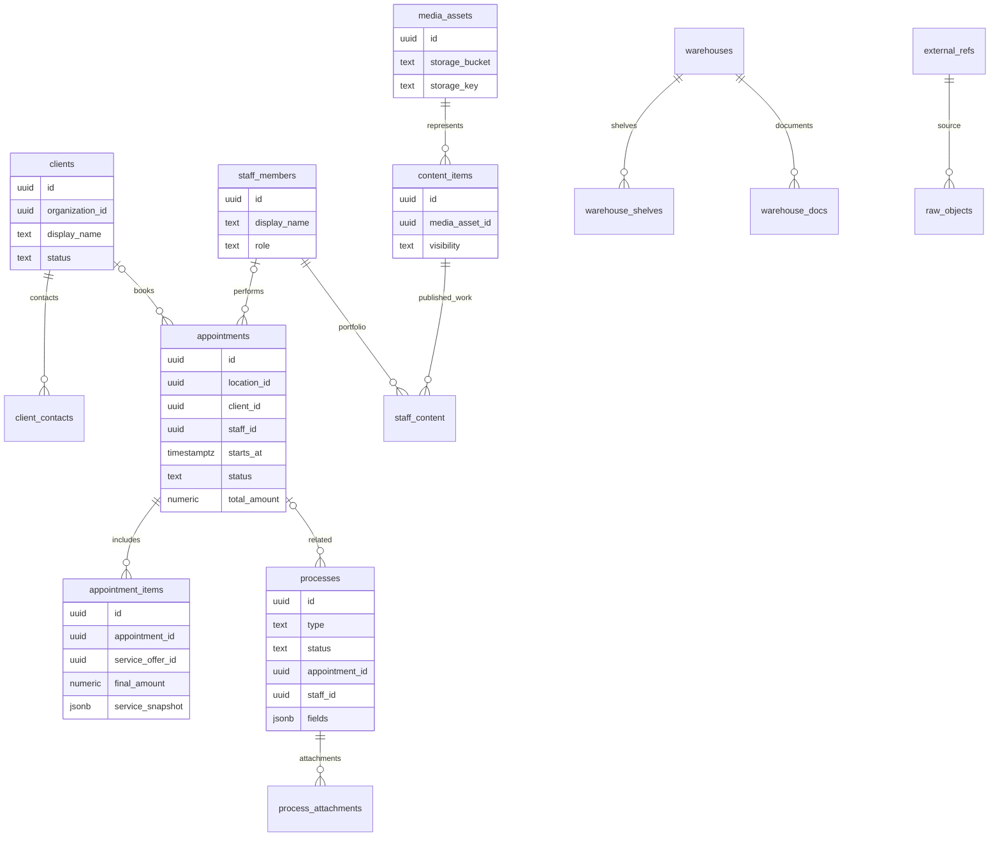
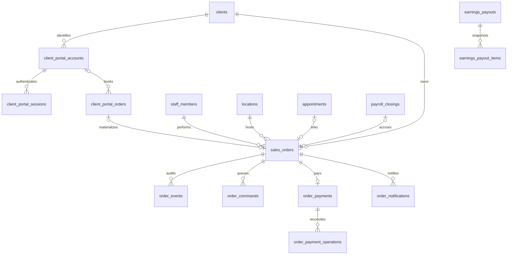

# База данных

[Вход в DOC](../AGENTS.md) · [Источники и SHA](sources.md)

## Что является источником схемы

Одна продуктовая PostgreSQL-БД, физическая схема `summy_data`. Логические слои
**raw → core → contract** описывают путь данных, а не три отдельные PostgreSQL-схемы.
Миграциями управляет Alembic backend: raw SQL в ревизиях, начальная ревизия
`0001_baseline`, ORM не используется для генерации всей схемы.
Источники: [ADR-0001](../decisions/0001-data-platform.md),
[backend/alembic/env.py](https://github.com/kirillsummy/backend/blob/bbfe5e5e22ca2eedbaf58db2899a60c4cdfa70f3/alembic/env.py), [backend/alembic/versions/0001_baseline.py](https://github.com/kirillsummy/backend/blob/bbfe5e5e22ca2eedbaf58db2899a60c4cdfa70f3/alembic/versions/0001_baseline.py).

База снимка `backend/dev` заканчивается файлами `0116_otzyvy_zerkalo`.
Это состояние Git, а не значение `alembic_version` на сервере.
Историческая схема в репозитории `docs` и архивные SQL в `data/` не образуют
второй журнал миграций. Источник: [дерево ревизий](https://github.com/kirillsummy/backend/tree/bbfe5e5e22ca2eedbaf58db2899a60c4cdfa70f3/alembic/versions),
[историческая проверка](https://github.com/kirillsummy/governance/blob/263d84b60a4f03bf158453f1fe7d295db146e1ab/docs/history/map-before-consolidation.md).

## Основные сущности и поля

Это обзор прочитанных моделей, **не полный DDL**. Типы/nullable/индексы/каскады
проверяют по последней миграции, затем по реальной схеме целевой среды.
Общие поля OrgScoped-моделей и связи не следует переносить на все таблицы:
например, `processes` и строки записей устроены иначе.

| Таблица | Ключевые поля из моделей | Связь / назначение |
|---|---|---|
| `staff_members` | `id`, `organization_id`, `display_name`, `first_name`, `last_name`, `role`, `specialization`, `description`, `origin`, `version` | Внутренняя личность сотрудника |
| `external_refs` | `id`, `connection_id`, `entity_type`, `internal_id`, `external_id`, `deleted_at` | Полиморфное соответствие внешнему объекту; `internal_id` не означает FK к одной таблице |
| `raw_objects` | `id`, `external_ref_id`, `object_type`, `payload`, `payload_hash`, `received_at`, `is_deleted` | Полученный внешний объект и его история/состояние |
| `clients` | `id`, `organization_id`, `display_name`, `first_name`, `last_name`, `birth_date`, `gender`, `status`, `version` | Клиент сети |
| `client_contacts` | `id`, `client_id`, `contact_type`, `value_raw`, `value_normalized`, `is_primary`, `is_verified` | Контакты отдельно от карточки клиента |
| `client_referrals` | `id`, `inviter_client_id`, `invited_client_id` | Кто пригласил клиента; уникальность активной связи задаёт миграция |
| `client_notes` | `id`, `client_id`, `author_ref`, `body`, `visibility`, `source`, `deleted_at` | История заметок; автор может быть внешним/неизвестным |
| `appointments` | `id`, `organization_id`, `location_id`, `client_id`, `staff_id`, `starts_at`, `ends_at`, `status`, `total_amount`, `currency`, `source_channel` | Запись клиента, сотрудник/клиент могут отсутствовать |
| `appointment_items` | `id`, `appointment_id`, `service_offer_id`, `staff_id`, `quantity`, `unit_price`, `discount_amount`, `final_amount`, `service_snapshot`, `staff_snapshot` | Позиции записи и снимки услуги/мастера |
| `processes` | `id`, `type`, `title`, `status`, `priority`, `assignee_role`, `appointment_id`, `staff_id`, `fields`, `source`, `external_ref` | Операционные карточки, включая ссылки на запись и мастера |
| `process_types` | `id`, `code`, `label`, `scope`, `statuses`, `transitions`, `fields`, `initial_status` | Описания видов/переходов — данные |
| `process_attachments` | `id`, `process_id`, `storage_key`, `content_type`, `size_bytes`, `deleted_at` | Метаданные вложения; байты в объектном хранилище |
| `warehouses` / `warehouse_shelves` | `id`, `name`, `deleted_at`; у полки `warehouse_id` | Склад и адресное хранение; склад не обязательно студия |
| `warehouse_docs` | `id`, `warehouse_id`, `target_warehouse_id`, `doc_type`, `reason`, `actor_id` | Проведённые документы движений; остаток вычисляется по строкам |
| `media_assets` | `id`, `storage_bucket`, `storage_key`, `mime_type`, `size_bytes`, `checksum_sha256`, `processing_status`, `metadata` | Файл в S3 и его метаданные |
| `content_items` | `id`, `media_asset_id`, `purpose`, `visibility`, `moderation_status`, `published_at` | Публикационное представление медиа |
| `staff_content` | `staff_id`, `content_item_id`, `sort_order` | Портфолио сотрудника; раздел витрины — дополнительное свойство связи |
| `gateway_admin_access` | `id`, `yclients_user_id`, `role`, `display_name`, `is_active`, `deleted_at` | Допуск в CRM |
| `gateway_role_sections` | `id`, `role`, `section_key`, `is_visible`, `can_edit` | Права разделов; таблица сама по себе не доказывает проверку каждого HTTP-метода |

Источники моделей:
[backend/app/domains/staff/models.py](https://github.com/kirillsummy/backend/blob/bbfe5e5e22ca2eedbaf58db2899a60c4cdfa70f3/app/domains/staff/models.py), [backend/app/domains/clients/models.py](https://github.com/kirillsummy/backend/blob/bbfe5e5e22ca2eedbaf58db2899a60c4cdfa70f3/app/domains/clients/models.py),
[backend/app/domains/appointments/models.py](https://github.com/kirillsummy/backend/blob/bbfe5e5e22ca2eedbaf58db2899a60c4cdfa70f3/app/domains/appointments/models.py), [backend/app/domains/processes/models.py](https://github.com/kirillsummy/backend/blob/bbfe5e5e22ca2eedbaf58db2899a60c4cdfa70f3/app/domains/processes/models.py),
[backend/app/domains/warehouses/models.py](https://github.com/kirillsummy/backend/blob/bbfe5e5e22ca2eedbaf58db2899a60c4cdfa70f3/app/domains/warehouses/models.py), [backend/app/domains/media/models.py](https://github.com/kirillsummy/backend/blob/bbfe5e5e22ca2eedbaf58db2899a60c4cdfa70f3/app/domains/media/models.py),
[backend/app/domains/auth/models.py](https://github.com/kirillsummy/backend/blob/bbfe5e5e22ca2eedbaf58db2899a60c4cdfa70f3/app/domains/auth/models.py).

## Обзор связей

Диаграмма показывает основные предметные связи по моделям; не заявляет,
что каждая линия обеспечивается FK в работающей БД. Nullable-ссылки и
полиморфный `external_refs.internal_id` требуют отдельного внимания.

## Расчётные VIEW и дрейф

Денежные `contract_v1_*` VIEW менялись несколькими миграциями. Нужно брать
последнее определение целиком, чтобы не потерять чужие колонки. ORM описывает
не всю схему; наличие ORM и зелёного unit-теста не подтверждает соответствие DDL.
Базовый CI накатывает миграции на чистый PostgreSQL 18 и выполняет `db/verify.sql`.
Автоматическая расширенная сверка схемы/VIEW/OpenAPI добавлена в открытый
[backend PR #80](https://github.com/kirillsummy/backend/pull/80); её нельзя считать
уже встроенной в `dev`. Источники: [backend/docs/DEBT.md](https://github.com/kirillsummy/backend/blob/bbfe5e5e22ca2eedbaf58db2899a60c4cdfa70f3/docs/DEBT.md),
[backend/.github/workflows/ci.yml](https://github.com/kirillsummy/backend/blob/bbfe5e5e22ca2eedbaf58db2899a60c4cdfa70f3/.github/workflows/ci.yml).

В аудите 16.09.2026 для ветки PR #80 получен локальный снимок: 146 таблиц,
44 VIEW, 6 последовательностей, 1917 колонок, 164 FK. **Это исторический
результат миграций на локальной PG18, не инвентаризация production.** Источник:
[schema-contract.json](https://github.com/kirillsummy/backend/blob/f53795b23999402eecfa2faa8f9098e9ce272904/db/schema-contract.json).

## Неслитые изменения схемы

- В `backend/test` есть `0117_staff_invitations` (собственный вход).
- В ветке обращений мастера есть другая `0117_master_requests_hours`.
- Последующие ветки клиентского контура/платежей добавляют
  `0118_client_portal`, `0119_order_payments_test`, `0120_quality_before_payment`.

Это независимые линии развития после `0116`. Перед объединением проверить
реальные `revision`/`down_revision`, головы Alembic, порядок применения и
совместимость данных; совпадение префикса `0117` уже требует внимания, но
само по себе не доказывает одинаковый внутренний revision ID.
Применённые миграции не переписывают. Источники: [ветки](branches.md),
[backend/test](https://github.com/kirillsummy/backend/tree/test/alembic/versions),
[backend/docs/master-shift-requests.md](https://github.com/kirillsummy/backend/blob/ea174dd267c873cc7ae1b8a95fb63d6c456fdf8a/docs/master-shift-requests.md),
[backend/docs/client-portal.md](https://github.com/kirillsummy/backend/blob/ea174dd267c873cc7ae1b8a95fb63d6c456fdf8a/docs/client-portal.md).

Не запускать restore/миграции по этой странице: действия с окружением выполняются
по runbook и полномочиям релиз-инженера. Реестр файлов: [sources](sources.md).

## Существенные инварианты нового контура

- sales_orders: уникальный number; уникальные ссылки на appointment/portal_order,
  хотя бы одна из них обязательна. Время — timestamptz; сумма numeric(14,2), RUB.
- Один order_payment на order, уникальный provider_order_id; environment ограничен sandbox.
  Операции провайдера имеют собственный UUID и уникальность внешней операции в платеже.
- order_events защищён триггером от UPDATE/DELETE. Команда имеет состояния
  queued/dispatching/confirmed/unknown/rejected; активная команда вида уникальна на заказ.
- client_portal_sessions содержит token_hash, не исходный токен. OTP имеет лимит
  попыток, срок жизни, delivered/consumed; аккаунт уникален по организации и телефону.
- 0119 разрешает запись сотрудником без client account; booked_client_id обязателен
  при отсутствии account. Это не создание клиентского согласия от имени сотрудника.
- 0120 делает appointment_closures.payroll_closing_id nullable, чтобы качество
  предшествовало оплате. Откат упадёт, если такие незавершённые связи ещё существуют.
- Состав выплаты earnings резервирует источники единожды; корректировка append-only,
  возврат клиенту не означает автоматическое удержание у мастера.

## Данные feature-заказа

## Миграции и доступ

SQL пишется вручную, Alembic — единственная последовательность; ORM зеркалит схему.
В проверенной feature-цепочке: 0117 → 0118 → 0119 → 0120_quality_before_payment.
В других ветках номера могут пересекаться: это не утверждение о head основной ветки.
Релиз-инженер разрешает конфликт новой ревизией/новым коммитом, не переписывает применённое.

Одна async-сессия/транзакция на запрос; успешный запрос commit, исключение rollback.
Проверки выполняются на отдельной БД, `db/verify.sql` — проверка схемы.
В orders флаг требует точного совпадения ORDERS_TEST_DATABASE и POSTGRES_DB.
Не использовать восстановление дампа как штатное обновление кода: старые stand/up
содержат очистку базы. Применение миграций на стенде/production здесь не выполнялось.

Обнаруженный долг: `app/db.py` при POSTGRES_SSL включает шифрование, но отключает
проверку сертификата и hostname. Это факт реализации, не рекомендация повторять настройку.
Изменять trust-модель следует с проверкой сертификатов окружения.
