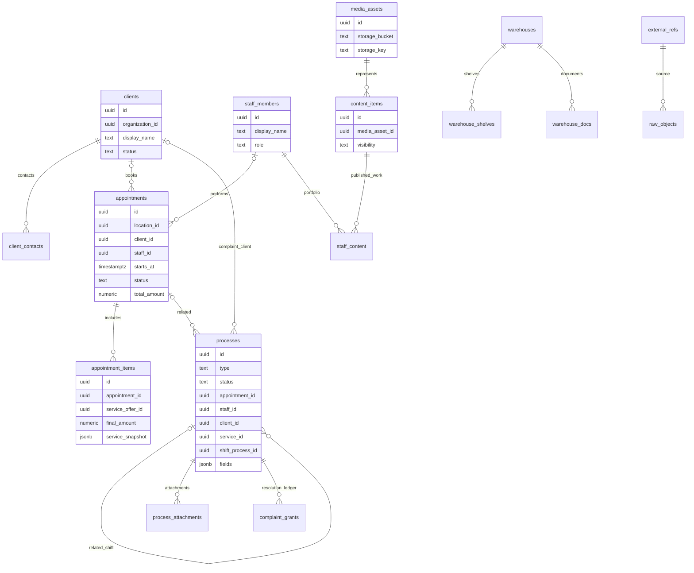
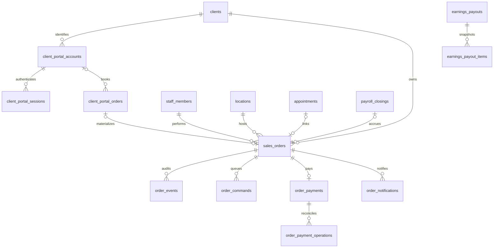

# База данных

[Вход в DOC](../AGENTS.md) · [Источники и SHA](sources.md)

## Production после выкладки RC2 28.09.2026

В существующей managed PostgreSQL production подтверждена ревизия
`0143_test_developer_access`: Alembic upgrade от `0116_otzyvy_zerkalo`
завершился с exit 0. Backend поставлен из
`5682ad92b828e4cfc3a8bbdbd3bbd63d6182aeff`; более поздние миграции `0144`
из `test` в этот выпуск не входили. Перед изменением создан и полностью
прочитан свежий дамп `summy-2026-09-28-1519.dump`; restore production
не выполнялся. Сверка счётчиков: таблиц 150→181, исчезнувших таблиц и
уменьшений строк нет, `process_types` 9→11. Подробности и пределы сравнения —
[отчёт RC2](releases/production-rc2-deployment-2026-09-28.md).

TEST остаётся отдельной БД; её последняя подтверждённая запись от 27.09 —
`0143_test_developer_access`, она не является повторной инвентаризацией TEST
во время production-выпуска. Безопасный доступ описан в
[инфраструктуре](infrastructure.md#подключение-к-dev-и-бд).
Старый backend после production-миграции 0143 runtime-проверку совместимости
не проходил; автоматический возврат образа, downgrade или restore не являются
универсальным откатом.

## SUM-120 и SUM-158: ревизия `0163_inventory_cash_totals`

Предшественник — `0162_penalty_appeals`. Только данные: вид процесса
`inventory_check` «Инвентаризация» (`submitted` → `confirmed` / `rejected`) —
источник премии администратора 1000 ₽
([payroll-v1](../contracts/payroll-v1.md#администратор)); три необязательных
поля анкеты `finance_report` — `cash_opening`, `z_cash_total`, `z_card_total`
([рабочие места](../contracts/role-workplaces.md#бухгалтер)). `downgrade`
отказывает, пока есть карточки `inventory_check`; значения новых полей в уже
сданных отчётах не удаляет. На общем TEST применена 01.10.2026 выпуском
`od-20261001` (backend `085c4f6ae21137c0cde35e15bf4702dad8a4b87b`); копия перед
ней — `/opt/summy-test/backups/od-20261001-before-0163.dump`. Production не
получал. Снимок `db/api-contract.json` пересобран генератором,
`db/schema-contract.json` не менялся (схема та же).

## SUM-111 P6: ревизия `0162_penalty_appeals`

Предшественник — `0161_review_photo`. Создаёт `staff_penalty_appeals`
(обжалование штрафа мастером: одно на штраф, комментарий, решение, автор,
ссылка на строку отмены) и вид процесса `penalty_appeal`; пересоздаёт
`contract_v1_staff_penalty_amounts` с новым последним столбцом `appeal_hold`
— при открытом обжаловании `amount_rub = 0`. Остальной расчёт витрины прежний,
зависимые витрины не пересоздавались. `downgrade` отказывает при наличии
обжалований; после отката `appeal_hold` остаётся постоянной `false`. Правило —
в [payroll-v1](../contracts/payroll-v1.md#обжалование-штрафных-баллов-sum-111-p6).
На общем TEST применена 01.10.2026 выпуском `fin7-20261001` (backend
`11c8d692519b0123ec6179a09f6bfbb89a3b7c78`) вместе с `0161`; копия перед ней —
`/opt/summy-test/backups/fin7-20261001-before-0161.dump`. Production не получал.
Снимки `db/schema-contract.json` и `db/views.sql` не пересобирались.

## D08: ревизия `0182_review_source_field`

Предшественник — `0181_staff_schedule_minutes_cache`. Только данные: виду
`review_photo` добавлено необязательное поле `review_source` «Источник
отзыва» (`kind` `text`); схема не меняется. Повтор источника у живой карточки
backend отклоняет 409 `review_source_taken`. `downgrade` отказывает, пока у
карточек есть значение поля. Проверена на БД Dev в откатываемой транзакции;
на Dev применена выпуском `dlv1003-dev-20261003` (03.10.2026 23:57 МСК) после
копии `/opt/summy-test/backups/dlv1003-dev-20261003-before-0182.dump`; число
строк контрольных таблиц не изменилось, невалидных индексов нет.

## SUM-120: ревизия `0161_review_photo`

Предшественник — `0160_daily_processes`. Только данные: вид процесса
`review_photo` «Отзыв с фото» — источник премии администратора 50 ₽
([payroll-v1](../contracts/payroll-v1.md#администратор)). `downgrade`
отказывает, пока есть карточки этого вида. TEST — 01.10.2026 вместе с `0162`.

## SUM-165: ревизия `0159_courier_deliveries`

Предшественник — `0158_role_workplaces`. Ревизия расширяет CHECK
`gateway_admin_access_role_known` значением `courier` и создаёт
`delivery_orders` (заказ доставки: курьер, места забора и доставки, состояние
и исполнители переходов), `delivery_order_items` (строки материалов
`tech_materials` с количеством и единицей) и `delivery_order_events` (журнал
действий с ролью исполнителя). Существующие таблицы и строки не меняются.
`downgrade` отказывает при наличии заказов доставки или допусков с ролью
`courier`. На общем TEST применена 30.09.2026 выкладкой `backend/test`
`a992249b91e09ed2c21ad9be841a7efe89d11963`; копия БД перед ней —
`/opt/summy-test/backups/courier-before-0159-20260930.dump`. Production её не
получал. Применение, откат и правила — в
[контракте рабочих мест](../contracts/role-workplaces.md#данные-и-откат).

## SUM-156, SUM-157, SUM-158: ревизия `0158_role_workplaces`

Предшественник — `0157_service_resource_exemptions`. Ревизия расширяет CHECK
`gateway_admin_access_role_known` значениями `storekeeper` и `purchaser` и
создаёт `purchase_requests` (заявка склада на закупку и отметка закупщика),
`hr_action_requests` (черновая кадровая заявка) и `accounting_documents`
(реестр документов бухгалтера с ключами файлов в объектном хранилище).
Существующие таблицы и строки не меняются. `downgrade` отказывает при наличии
строк в новых таблицах или допусков с новыми ролями. На общем TEST применена
30.09.2026; production её не получал. Правила — в
[контракте рабочих мест](../contracts/role-workplaces.md).

## Кандидат SUM-119: ревизия `0151_complaint_claims`

> Порядок ревизий после `0148_payroll_v1` на 29.09.2026: `0149_staff_penalty_payroll`
> (SUM-116), `0150_cleaning_rates_manager_pay` (SUM-120), `0151_complaint_claims`
> (SUM-119), `0152_service_resource_source` (SUM-115) — все в `backend/test`
> `85c4d9b`; затем `0153_client_loyalty_credits` (SUM-103, в `test` `214b128`) и
> `0154_process_type_colors` (краски двух видов, в `test` `bf4a947`, голова).
> Полная цепочка — в [разделе SUM-120](#кандидат-sum-120-ставки-уборки-и-факты-оплаты-управляющей).

Ревизия `0151_complaint_claims` следует за `0150_cleaning_rates_manager_pay`, кандидат
backend `aa194a4` поверх `31b6b23`. Прежнее неопубликованное имя —
`0149_complaint_claims` после `0148_payroll_v1`. При переносе изменились только
revision, down_revision, имена файлов и текст отказа downgrade; SQL прежний.
Ревизия добавляет к `processes` четыре поля
принятия рекламации (`claimed_by_id`, `claimed_by_name`, `claimed_at`,
`claim_expires_at`), проверки полноты и типа карточки, индекс срока, а к
`process_events.kind` — `claimed` и `claim_released`. Перед применением нужны
точная ревизия целевой БД и проверка актуального head; подготовленный файл не
доказывает, что миграция применена на общем TEST.

Локально 29.09 на одноразовой PostgreSQL 18: цепочка с нуля до `0151`,
один head, `downgrade -1` до `0150` и повторный `upgrade`. Снимок схемы после
пересборки генератором отличается от `31b6b23` только объектами 0151.

Downgrade `0151` откажется выполняться после первого принятия или события
снятия: история append-only. План отката после появления таких фактов — вернуть
старый backend без отката схемы, предварительно проверив совместимость и точные
образы. Удалять историю ради downgrade нельзя.

## Кандидат SUM-120: ставки уборки и факты оплаты управляющей

Ревизия backend `0150_cleaning_rates_manager_pay` следует за
`0149_staff_penalty_payroll` (SUM-116). Она собрана в локальном кандидате
`31b6b23` поверх `backend/test` `ecf87af` (SUM-93 поверх SUM-116 `e6addc4`) и
**не опубликована**. В `ecf87af` последняя ревизия — `0149_staff_penalty_payroll`.
Прежние имена ревизии кандидата — `0149_cleaning_location_rates` и
`0149_cleaning_rates_manager_pay` после `0148_payroll_v1` (кандидаты `4e6cc24`,
`0304aa2`). Оба имени не публиковались; применение к общей TEST-БД
проверяется отдельно перед выкладкой. Посевные ставки ревизии записаны от
`migration:0150`.

Объекты `0149_staff_penalty_payroll` (`staff_penalties.payroll_eligible`,
витрины `contract_v1_staff_penalty_amounts`, `contract_v1_earnings_sources`,
`contract_v1_earnings_blockers`) ревизия 0150 не создаёт, не заменяет и не
удаляет, в том числе при `downgrade`.

Порядок ревизий на 29.09.2026: `0148_payroll_v1` → `0149_staff_penalty_payroll`
(SUM-116) → `0150_cleaning_rates_manager_pay` (SUM-120) → `0151_complaint_claims`
(SUM-119) → `0152_service_resource_source` (SUM-115; все четыре в `backend/test`
`85c4d9b`) → `0153_client_loyalty_credits` (SUM-103, в `test` `214b128`,
[ревизия веток](history/branch-audit-2026-09-29.md#выборочный-перенос-work-локальные-кандидаты-29092026))
→ `0154_process_type_colors` (в `test` `bf4a947`, голова: только данные — краски
`appointment_reschedule` и `payroll_dispute`, см. [палитру](../contracts/brand-palette.md#краски-видов-процессов-полоса-на-доске-crm)).
Применение 0152–0154 к общей TEST-БД (на ней `0151`) подтверждается отдельно. Одновременно публиковать две ревизии с одним номером или две
головы Alembic нельзя.

Ревизия аддитивная, существующие данные не меняются. Она создаёт:

- `cleaning_location_rates` — базовая ставка филиала за выход, `command_id`
  и `command_hash` для команд. Две начальные строки получают дату версии
  `2026-09-29` для `yclients-386571` (1 200 ₽) и `yclients-481570` (800 ₽). Если
  справочник филиалов не пуст, а живых филиалов с этими кодами не ровно два,
  ревизия останавливается. Пустой справочник ставок не получает.
- `cleaning_staff_rates` — персональная ставка уборщицы: сумма или `NULL`
  (ставка снята), дата начала, причина, автор, команда.
- `manager_pay_facts` — факты оплаты управляющей, подтверждённые Кириллом
  (включая `development_guarantee_cancel`). CHECK проверяет форму каждого
  вида, 1-е число месяца и диапазон гарантии 20 000–40 000 ₽.
- функцию `payroll_rate_history_append_only`: её триггер запрещает UPDATE и
  DELETE во всех трёх таблицах.

Коды филиалов — публичные идентификаторы справочника, не клиентские данные.

Downgrade удаляет три таблицы, но только пустые: если есть ставка, записанная
командой (`command_id IS NOT NULL`), персональная ставка или факт
управляющей, он отказывает с `check_violation`. Посевные ставки ревизии не
мешают. Destructive downgrade после записи новых ставок или фактов запрещён;
план отката — вернуть совместимый backend без downgrade, предварительно
проверив совместимость.

Проверки 29.09.2026 на одноразовой PostgreSQL 18.6 (кластер WSL, порт 55439,
синтетические данные; общий TEST не затрагивался):

- `alembic upgrade head` с нуля, `downgrade -1` и повторный `upgrade`;
  `alembic heads` — один head;
- заполнение ставок: при одном живом из двух филиалов ревизия
  останавливается, при двух заводит 1 200 и 800 ₽; DELETE отклонён
  триггером;
- `db/verify.sql` — `verification passed`;
- `db/schema-contract.json` и `db/api-contract.json` пересобраны генераторами,
  сверка `python -m app.schema_contract` и `python -m app.api_contract` — OK.

Снимок схемы заодно получил объекты ревизий 0145 и 0148, которых не было в
снимке `origin/test`: это прежний дрейф снимка, сами ревизии не менялись.

Повторно 29.09.2026 после ревью: `upgrade` с нуля, `downgrade -1` на пустых
таблицах и повторный `upgrade`; `downgrade -1` при записанном факте —
отказ, ревизия и данные на месте; снимки пересобраны и сверены. Правило — в
[контракте](../contracts/payroll-v1.md#управляющая-и-уборщица).

После переноса на `backend/test` `ecf87af` (кандидат `31b6b23`), 29.09.2026,
та же одноразовая PostgreSQL: `alembic heads` — один head
`0150_cleaning_rates_manager_pay`. Цепочка с нуля проходит `0148` → `0149_staff_penalty_payroll` →
`0150`. Определения трёх витрин SUM-116 и колонка `payroll_eligible` после
`upgrade` и `downgrade -1` ревизии 0150 совпадают с состоянием на 0149.
Посев при двух живых филиалах записан от `migration:0150`. `downgrade -1` при
записанном факте получает отказ. `db/schema-contract.json` пересобран: в
снимке `origin/test` не хватало объектов `0149_staff_penalty_payroll`.
OpenAPI-снимок совпал. На общей TEST-БД ничего не применялось.

## Исторический ориентир после релиза 25.09.2026

По [журналу фактического состояния](current-state.md) на TEST сначала
применили `0140_admin_shift_process`, затем при отдельной поставке backend —
`0141`. Это отчёты о выполненных действиях 25.09, **не** повторное чтение
`alembic_version` 26.09. Последняя голова Git `backend/test` и запущенный
сервер могут различаться. Исторические сравнения `work`/`test` ниже оставлены
для аудита расхождений до объединения; не использовать их как текущую матрицу
веток. Действующая матрица — [ветки](branches.md), безопасный способ доступа
и релиза — [инфраструктура](infrastructure.md#подключение-к-dev-и-бд).

## Что является источником схемы

В каждой среде своя продуктовая PostgreSQL-БД с физической схемой
`summy_data`; TEST не подключён к production-БД. Логические слои
**raw → core → contract** описывают путь данных, а не три отдельные PostgreSQL-схемы.
Миграциями управляет Alembic backend: raw SQL в ревизиях, начальная ревизия
`0001_baseline`, ORM не используется для генерации всей схемы.
Источники: [ADR-0001](../decisions/0001-data-platform.md),
[backend/alembic/env.py](https://github.com/kirillsummy/backend/blob/bbfe5e5e22ca2eedbaf58db2899a60c4cdfa70f3/alembic/env.py), [backend/alembic/versions/0001_baseline.py](https://github.com/kirillsummy/backend/blob/bbfe5e5e22ca2eedbaf58db2899a60c4cdfa70f3/alembic/versions/0001_baseline.py).

База снимка `backend/dev` заканчивается файлами `0116_otzyvy_zerkalo`.
Это состояние Git, а не значение `alembic_version` на сервере.
Историческая схема в репозитории `docs` и архивные SQL в `data/` не образуют
второй журнал миграций. Источник: [дерево ревизий](https://github.com/kirillsummy/backend/tree/bbfe5e5e22ca2eedbaf58db2899a60c4cdfa70f3/alembic/versions),
[историческая проверка](https://github.com/kirillsummy/governance/blob/263d84b60a4f03bf158453f1fe7d295db146e1ab/docs/history/map-before-consolidation.md).

В срезе `backend/work` `ca369db` на 25.09.2026 цепочка
продолжена до `0139_complaint_shift_organization_guard`:
`0125` — каноническая модель, `0127` — идемпотентность создания,
`0128` — задания, `0130` — сверка начислений, `0131` — переделка,
`0132` — снимок ставки штрафного балла, `0133` — виды событий решения,
`0134` — правило фотоподтверждений v2, `0135` — запросы наличного вывода;
`0136`–`0139` описаны ниже.
В том срезе `backend/test` содержал **тот же файл `0125`** и заканчивался
`0126`, а базовая ветка `dev` — `0116`; `test` и `work` разошлись по Git.
Наличие файлов в Git не доказывало применение в БД; `alembic_version`
test/production тогда не проверялся. Порядок приёмки и обязательные действия
владельца БД закреплены в
[контракте рекламаций](../contracts/reklamaciya.md).

## Основные сущности и поля

Это обзор прочитанных моделей, **не полный DDL**. Типы/nullable/индексы/каскады
проверяют по последней миграции, затем по реальной схеме целевой среды.
Общие поля OrgScoped-моделей и связи не следует переносить на все таблицы:
например, `processes` и строки записей устроены иначе.

| Таблица | Ключевые поля из моделей | Связь / назначение |
|---|---|---|
| `staff_members` | `id`, `organization_id`, `display_name`, `first_name`, `last_name`, `role`, `specialization`, `description`, `origin`, `version` | Внутренняя личность сотрудника |
| `external_refs` | `id`, `connection_id`, `entity_type`, `internal_id`, `external_id`, `deleted_at` | Полиморфное соответствие внешнему объекту; `internal_id` не означает FK к одной таблице |
| `raw_objects` | `id`, `external_ref_id`, `object_type`, `payload`, `payload_hash`, `received_at`, `is_deleted` | Полученный внешний объект и его история/состояние |
| `clients` | `id`, `organization_id`, `display_name`, `first_name`, `last_name`, `birth_date`, `gender`, `status`, `version` | Клиент сети |
| `client_contacts` | `id`, `client_id`, `contact_type`, `value_raw`, `value_normalized`, `is_primary`, `is_verified` | Контакты отдельно от карточки клиента |
| `client_referrals` | `id`, `inviter_client_id`, `invited_client_id` | Кто пригласил клиента; уникальность активной связи задаёт миграция |
| `client_notes` | `id`, `client_id`, `author_ref`, `body`, `visibility`, `source`, `deleted_at` | История заметок; автор может быть внешним/неизвестным |
| `appointments` | `id`, `organization_id`, `location_id`, `client_id`, `staff_id`, `starts_at`, `ends_at`, `status`, `total_amount`, `currency`, `source_channel`, `complaint_process_id`, `source_appointment_id`, `is_free_redo` | Запись клиента; nullable-связи переделки добавлены в work ревизией 0131 |
| `appointment_items` | `id`, `appointment_id`, `service_offer_id`, `staff_id`, `quantity`, `unit_price`, `discount_amount`, `final_amount`, `service_snapshot`, `staff_snapshot` | Позиции записи и снимки услуги/мастера |
| `processes` | `id`, `type`, `title`, `status`, `priority`, `assignee_role`, `appointment_id`, `staff_id`, `client_id`, `service_id`, `shift_process_id`, `location_id`, `create_request_id`, `create_request_hash`, `fields`, `source`, `external_ref` | Связи рекламации вынесены из анкеты в FK; `location_id` для системной смены администратора добавляет ревизия 0140 только в work |
| `process_types` | `id`, `code`, `label`, `scope`, `statuses`, `transitions`, `fields`, `initial_status` | Описания видов/переходов — данные |
| `process_attachments` | `id`, `process_id`, `storage_key`, `content_type`, `size_bytes`, `deleted_at` | Метаданные вложения; байты в объектном хранилище |
| `process_tasks` | `id`, `organization_id`, `process_id`, `kind`, `title`, `required`, `status`, `assignee_role`, `assignee_id`, `due_at`, `completed_at` | Универсальные задания и сроки процесса; 0128 |
| `complaint_grants` | `id`, `complaint_id`, `decision_kind`, `bonus_size`, `amount_rub`, `status`, `idempotency_key`, `fail_reason`, `grant_note`, `granted_at` | Журнал попыток предоставления; завершённые строки защищены от UPDATE/DELETE |
| `complaint_grant_reconciliations` | `id`, `organization_id`, `complaint_id`, `grant_id`, `outcome`, `note`, `idempotency_key`, `created_by_id`, `created_at` | Отдельный append-only результат операторской сверки; 0130 |
| `warehouses` / `warehouse_shelves` | `id`, `name`, `deleted_at`; у полки `warehouse_id` | Склад и адресное хранение; склад не обязательно студия |
| `warehouse_docs` | `id`, `warehouse_id`, `target_warehouse_id`, `doc_type`, `reason`, `actor_id` | Проведённые документы движений; остаток вычисляется по строкам |
| `media_assets` | `id`, `storage_bucket`, `storage_key`, `mime_type`, `size_bytes`, `checksum_sha256`, `processing_status`, `metadata` | Файл в S3 и его метаданные |
| `content_items` | `id`, `media_asset_id`, `purpose`, `visibility`, `moderation_status`, `published_at` | Публикационное представление медиа |
| `staff_content` | `staff_id`, `content_item_id`, `sort_order` | Портфолио сотрудника; раздел витрины — дополнительное свойство связи |
| `gateway_admin_access` | `id`, `yclients_user_id`, `role`, `display_name`, `is_active`, `deleted_at` | Допуск в CRM |
| `gateway_role_sections` | `id`, `role`, `section_key`, `is_visible`, `can_edit` | Права разделов; таблица сама по себе не доказывает проверку каждого HTTP-метода |

Источники моделей:
[backend/app/domains/staff/models.py](https://github.com/kirillsummy/backend/blob/bbfe5e5e22ca2eedbaf58db2899a60c4cdfa70f3/app/domains/staff/models.py), [backend/app/domains/clients/models.py](https://github.com/kirillsummy/backend/blob/bbfe5e5e22ca2eedbaf58db2899a60c4cdfa70f3/app/domains/clients/models.py),
[backend/app/domains/appointments/models.py](https://github.com/kirillsummy/backend/blob/bbfe5e5e22ca2eedbaf58db2899a60c4cdfa70f3/app/domains/appointments/models.py), [backend/app/domains/processes/models.py](https://github.com/kirillsummy/backend/blob/bbfe5e5e22ca2eedbaf58db2899a60c4cdfa70f3/app/domains/processes/models.py),
[backend/app/domains/warehouses/models.py](https://github.com/kirillsummy/backend/blob/bbfe5e5e22ca2eedbaf58db2899a60c4cdfa70f3/app/domains/warehouses/models.py), [backend/app/domains/media/models.py](https://github.com/kirillsummy/backend/blob/bbfe5e5e22ca2eedbaf58db2899a60c4cdfa70f3/app/domains/media/models.py),
[backend/app/domains/auth/models.py](https://github.com/kirillsummy/backend/blob/bbfe5e5e22ca2eedbaf58db2899a60c4cdfa70f3/app/domains/auth/models.py).

## Обзор связей

Диаграмма показывает основные предметные связи по моделям; не заявляет,
что каждая линия обеспечивается FK в работающей БД. Nullable-ссылки и
полиморфный `external_refs.internal_id` требуют отдельного внимания.

```mermaid
erDiagram
  clients ||--o{ client_contacts : contacts
  clients o|--o{ appointments : books
  staff_members o|--o{ appointments : performs
  appointments ||--o{ appointment_items : includes
  appointments o|--o{ processes : related
  clients o|--o{ processes : complaint_client
  processes o|--o{ processes : related_shift
  processes ||--o{ process_attachments : attachments
  processes ||--o{ complaint_grants : resolution_ledger
  media_assets ||--o{ content_items : represents
  staff_members ||--o{ staff_content : portfolio
  content_items ||--o{ staff_content : published_work
  warehouses ||--o{ warehouse_shelves : shelves
  warehouses ||--o{ warehouse_docs : documents
  external_refs ||--o{ raw_objects : source
  clients {
    uuid id
    uuid organization_id
    text display_name
    text status
  }
  staff_members {
    uuid id
    text display_name
    text role
  }
  appointments {
    uuid id
    uuid location_id
    uuid client_id
    uuid staff_id
    timestamptz starts_at
    text status
    numeric total_amount
  }
  appointment_items {
    uuid id
    uuid appointment_id
    uuid service_offer_id
    numeric final_amount
    jsonb service_snapshot
  }
  processes {
    uuid id
    text type
    text status
    uuid appointment_id
    uuid staff_id
    uuid client_id
    uuid service_id
    uuid shift_process_id
    jsonb fields
  }
  media_assets {
    uuid id
    text storage_bucket
    text storage_key
  }
  content_items {
    uuid id
    uuid media_asset_id
    text visibility
  }
```

## Расчётные VIEW и дрейф

Денежные `contract_v1_*` VIEW менялись несколькими миграциями. Нужно брать
последнее определение целиком, чтобы не потерять чужие колонки. ORM описывает
не всю схему; наличие ORM и зелёного unit-теста не подтверждает соответствие DDL.
`backend/db/roles.sql` сейчас содержит лишь закомментированный пример, а не
применённые права: роль `adminapp_ro` должна создаваться оператором БД и
получать явные GRANT на нужные `contract_v1_*`; новая витрина не откроется ей
автоматически. `db/verify.sql` проверяет, в частности, что мастер зеркальной
записи доступен для фильтра визитов и `contract_v1_staff_day_load`.
«Копилка» по ревизии 0054 считает несколько подходящих услуг одной закрытой
записью, со ставкой из настроек. Витрина дневной загрузки учитывает живую
запись и при отсутствии графика, в салонных сутках филиала.
`db/fixtures/payroll-masterapp-fixture.sql` и `payroll-platform-seed.sql` —
вымышленные парные образцы прежнего перелива зарплаты, удалённого 17.08.2026,
а не данные боевой БД. Они фиксируют форму старых таблиц, YClients staff
501/502 и записи 9001–9003; вторая услуга записи 9002 намеренно не имеет
платформенной цены. Плановая запись 9004 не является закрытием и не должна
участвовать в переливе. Эти файлы запускаются лишь в одноразовой БД.
Базовый CI накатывает миграции на чистый PostgreSQL 18 и выполняет `db/verify.sql`.
Автоматическая расширенная сверка схемы/VIEW/OpenAPI добавлена в открытый
[backend PR #80](https://github.com/kirillsummy/backend/pull/80); её нельзя считать
уже встроенной в `dev`. Источники: [backend/docs/DEBT.md](https://github.com/kirillsummy/backend/blob/bbfe5e5e22ca2eedbaf58db2899a60c4cdfa70f3/docs/DEBT.md),
[backend/.github/workflows/ci.yml](https://github.com/kirillsummy/backend/blob/bbfe5e5e22ca2eedbaf58db2899a60c4cdfa70f3/.github/workflows/ci.yml).

В аудите 16.09.2026 для ветки PR #80 получен локальный снимок: 146 таблиц,
44 VIEW, 6 последовательностей, 1917 колонок, 164 FK. **Это исторический
результат миграций на локальной PG18, не инвентаризация production.** Источник:
[schema-contract.json](https://github.com/kirillsummy/backend/blob/f53795b23999402eecfa2faa8f9098e9ce272904/db/schema-contract.json).

## Исторический аудит изменений схемы до объединения веток

Актуальная удалённая рабочая линия backend на 24.09.2026 содержит миграции до `0135`.
Ревизия `0125` добавляет связи рекламации, ограничения согласованности,
индексы фильтрации и защиту append-only журнала `complaint_grants`; последующие
ревизии расширяют создание, задания, сверку, переделку, штрафы и другие домены.
`db/api-contract.json` и `db/schema-contract.json` в work статически содержат
новые поверхности, но их генерация/сравнение в этой проверке не выполнялись.
Перед их
применением владелец БД обязан подтвердить реальный head целевой среды и отсутствие
другой ревизии с тем же номером/`revision`; локальный номер файла не является
доказательством совместимости.

В опубликованном `backend/work` `ca369db` после `0135` добавлены `0136`–`0139`:

- `0136` выводит отсутствующий `processes.organization_id` у старой рекламации
  только при согласии всех найденных связей; неоднозначные записи оставляет
  `NULL`, защищает `process_events` от UPDATE/DELETE, допускает сверку
  сохранённого `chosen` без `fail_reason` и добавляет `flow` в денежный VIEW;
- `0137` хранит явные права филиалов для конкретной активной строки допуска
  CRM; при отсутствии права администратор и управляющий не видят рекламацию;
  `auth_audit` защищён от UPDATE/DELETE;
- `0138` добавляет очередь уведомлений рекламаций в общую `outbox_events`,
  не в `order_notifications`; триггер ставит её из сохранённого события в
  той же транзакции, дедупликация идёт по событию и получателю. Канал доставки
  не утверждён, поэтому `unavailable` не считается отправкой;
- `0139` сначала присваивает старой смене с пустой организацией организацию
  лишь при глобально однозначном коде действующего филиала. Затем проверяет
  существующие связи рекламации со сменой: при неоднозначности или конфликте
  миграция останавливается, не угадывая правильную. Новый DB-триггер требует,
  чтобы `shift_process_id` ссылался на действующую `master_shift` той же
  организации, и запрещает обратное изменение организации/типа/удаления
  связанной смены. Проверка применяется ко всем процессам, использующим это
  поле; конфликты разбирает владелец данных.

Опубликованная в `backend/work` (`51bc8a6`) ревизия
`0140_admin_shift_process` добавляет nullable
`processes.location_id` с FK к филиалу и составной охраной совпадения
организации, CHECK полноты строки `admin_shift`, уникальный индекс одной
открытой смены на администратора и возможность использовать существующие
`create_request_id`/SHA-256 для этого системного вида. `shift_report` и его
табель не меняются. Строка `process_types.admin_shift` создаётся архивной:
прежний backend не покажет её в общей форме между миграцией и кодом, а
DB-ограничение запрещает сделать её обычным выбираемым видом. Открытие и
закрытие оставляют `process_events`. После появления смен downgrade
останавливается, чтобы не удалить факты; старый backend после этого также
не является безопасным откатом. Применение 0140 в реальной БД и новые
generated OpenAPI/schema snapshots не подтверждены.

Локально на новой PostgreSQL 18.6 пройдены миграции с нуля и отдельная
синтетическая репетиция `0126→0139→0135`: однозначная старая рекламация
восстановлена, неоднозначная не угадана, попытка `chosen` без `fail_reason`,
штраф и выплата сохранены. Это **не** копия TEST-БД с реальными данными и не
доказательство, что на TEST уже применена `0125` или более поздняя ревизия.

Откат не равен простому `alembic downgrade`: downgrade ревизий 0127,
0129–0131 и 0133–0135 содержит guards на данные, а
`0132_complaint_penalty_rate_downgrade.sql` удаляет исторический
`point_price_rub`. До изменения БД нужен план совместимости, резервной
копии и восстановления, согласованный владельцем. В compose для API и
миграций используется `POSTGRES_USER` (default `summy_data_owner`);
отдельная runtime-роль мигратора и реальные права test/production не
проверены. Это конфигурация исходника, не проверка ACL.

### Перед применением на TEST — отдельное действие владельца БД

Миграции `0136`–`0139` сейчас являются опубликованным кодом, **не изменением
TEST-БД**. Кирилл либо назначенный им оператор сначала подтверждает подлинность
SSH host key независимо от самого соединения и читает в целевой среде
развёрнутый SHA, `alembic current`/`heads`, `current_user`, владельцев объектов
и право `CREATE` в `summy_data`. Отдельно считает старые рекламации с
`organization_id IS NULL`, неоднозначные связи и существующие связи
`complaint.shift_process_id`, где организация рекламации и смены различается.
При таких строках 0139 намеренно остановится: нельзя исправлять их догадкой,
`stamp`, удалением или ручным переписыванием истории.

До разрешённого `alembic upgrade head` нужны проверенная резервная копия с
точкой восстановления, сохранённый SHA прежнего backend-образа, план
совместимости со старым кодом и окно без параллельного деплоя. После применения
оператор сверяет `alembic current` с головой **именно доставленного коммита**,
новые ограничения/триггеры и безопасные read-only сценарии CRM. `downgrade`
не является универсальным откатом: часть прежних ревизий имеет guards или
теряет историческую ставку, поэтому восстановление проводится по заранее
согласованному плану и копии. Ни этот текст, ни публикация миграций в Git не
разрешают запуск на TEST или production; фактический результат и роль
мигратора записываются сюда без секретов и клиентских данных.

Ниже сохранён исторический контекст ветвления после `0116`; он не описывает
текущий head `backend/work`:

- Тогда в `backend/test` была `0117_staff_invitations` (собственный вход).
- В ветке обращений мастера есть другая `0117_master_requests_hours`.
- Последующие ветки клиентского контура/платежей добавляют
  `0118_client_portal`, `0119_order_payments_test`, `0120_quality_before_payment`.

Это историческое описание независимых линий после `0116`, а не текущий
перечень голов. На момент той сверки `test` дошла до `0126`, `work` — до `0135`, а
`singular` остаётся отдельной линией с головой `0117_staff_invitations`.
Перед объединением проверить
реальные `revision`/`down_revision`, головы Alembic, порядок применения и
совместимость данных; совпадение префикса `0117` уже требует внимания, но
само по себе не доказывает одинаковый внутренний revision ID.
Применённые миграции не переписывают. Источники: [ветки](branches.md),
[backend/test](https://github.com/kirillsummy/backend/tree/test/alembic/versions),
[backend/docs/master-shift-requests.md](https://github.com/kirillsummy/backend/blob/ea174dd267c873cc7ae1b8a95fb63d6c456fdf8a/docs/master-shift-requests.md),
[backend/docs/client-portal.md](https://github.com/kirillsummy/backend/blob/ea174dd267c873cc7ae1b8a95fb63d6c456fdf8a/docs/client-portal.md).

Не запускать restore/миграции по этой странице: действия с окружением выполняются
по runbook участником с фактическим доступом, в порядке очереди релиза. Реестр файлов: [sources](sources.md).

## Существенные инварианты нового контура

- sales_orders: уникальный number; уникальные ссылки на appointment/portal_order,
  хотя бы одна из них обязательна. Время — timestamptz; сумма numeric(14,2), RUB.
- Один order_payment на order, уникальный provider_order_id; environment ограничен sandbox.
  Операции провайдера имеют собственный UUID и уникальность внешней операции в платеже.
- order_events защищён триггером от UPDATE/DELETE. Команда имеет состояния
  queued/dispatching/confirmed/unknown/rejected; активная команда вида уникальна на заказ.
- client_portal_sessions содержит token_hash, не исходный токен. OTP имеет лимит
  попыток, срок жизни, delivered/consumed; аккаунт уникален по организации и телефону.
- 0119 разрешает запись сотрудником без client account; booked_client_id обязателен
  при отсутствии account. Это не создание клиентского согласия от имени сотрудника.
- 0120 делает appointment_closures.payroll_closing_id nullable, чтобы качество
  предшествовало оплате. Откат упадёт, если такие незавершённые связи ещё существуют.
- Состав выплаты earnings резервирует источники единожды; корректировка append-only,
  возврат клиенту не означает автоматическое удержание у мастера.

## Данные feature-заказа

```mermaid
erDiagram
  clients ||--o{ client_portal_accounts : identifies
  client_portal_accounts ||--o{ client_portal_sessions : authenticates
  client_portal_accounts o|--o{ client_portal_orders : books
  clients ||--o{ sales_orders : owns
  staff_members ||--o{ sales_orders : performs
  locations ||--o{ sales_orders : hosts
  appointments o|--o| sales_orders : links
  client_portal_orders o|--o| sales_orders : materializes
  sales_orders ||--o{ order_events : audits
  sales_orders ||--o{ order_commands : queues
  sales_orders ||--o| order_payments : pays
  order_payments ||--o{ order_payment_operations : reconciles
  sales_orders ||--o{ order_notifications : notifies
  payroll_closings o|--o| sales_orders : accrues
  earnings_payouts ||--o{ earnings_payout_items : snapshots
```

## Миграции и доступ

SQL пишется вручную, Alembic — единственная последовательность; ORM зеркалит схему.
В проверенной feature-цепочке: 0117 → 0118 → 0119 → 0120_quality_before_payment.
В других ветках номера могут пересекаться: это не утверждение о head основной ветки.
Конфликт номеров разрешают новой ревизией/новым коммитом (координирует Юра), применённое не переписывают.

Одна async-сессия/транзакция на запрос; успешный запрос commit, исключение rollback.
Проверки выполняются на отдельной БД, `db/verify.sql` — проверка схемы.
В orders флаг требует точного совпадения ORDERS_TEST_DATABASE и POSTGRES_DB.
Не использовать восстановление дампа как штатное обновление кода: старые stand/up
содержат очистку базы. Этот раздел описывал срез без применения миграций;
позднейшее применение `0140` и `0141` на TEST отражено в начале страницы и
в [текущем состоянии](current-state.md). Production этим не подтверждён.

Обнаруженный долг: `app/db.py` при POSTGRES_SSL включает шифрование, но отключает
проверку сертификата и hostname. Это факт реализации, не рекомендация повторять настройку.
Изменять trust-модель следует с проверкой сертификатов окружения.
